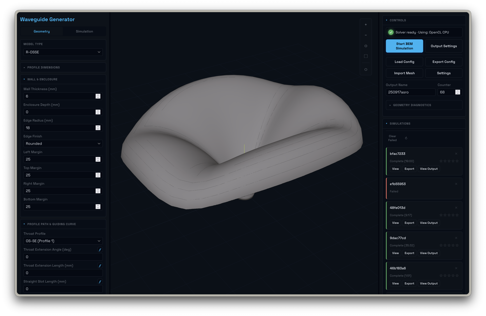

# Waveguide Generator

A browser-based tool for designing acoustic horns — live 3D preview, parameter controls, BEM simulation, and file exports for manufacturing and simulation workflows.



## Documentation

- [Project Documentation](docs/PROJECT_DOCUMENTATION.md) - maintained architecture and runtime reference
- [Testing Guide](tests/TESTING.md) - canonical test map, commands, and diagnostics
- [Future Additions](docs/FUTURE_ADDITIONS.md) - working backlog (periodically reviewed/pruned)
- [Archive Index](docs/archive/README.md) - superseded plans and historical reports

## Get the project files

Choose one method:

- **Git users**:
  ```bash
  git clone https://github.com/m3gnus/waveguide-generator.git
  cd waveguide-generator
  ```
- **No Git (ZIP download)**:
  1. Open [github.com/m3gnus/waveguide-generator](https://github.com/m3gnus/waveguide-generator)
  2. Click **Code** → **Download ZIP**
  3. Extract the ZIP completely
  4. Open the extracted folder (usually `waveguide-generator-main`)

The **project folder** means the folder that contains `package.json`.

## Prerequisites

Two things need to be installed on your computer before you begin:

- **[Node.js 18+](https://nodejs.org/)** — download and install the LTS version
- **[Python 3.10 - 3.14](https://www.python.org/downloads/)** — on Windows, tick *"Add python.exe to PATH"* during install

That's all. Everything else is handled by the setup script.

## Install

Run this **once** from the project folder to install all dependencies:

- **Windows** — double-click `SETUP-WINDOWS.bat`
- **macOS** — double-click `SETUP-MAC.command`
- **Linux** — run:
  ```bash
  ./SETUP-LINUX.sh
  ```

These setup entrypoints validate that you are in the full project folder, then run the platform installer in `install/`.
The installer checks your environment, installs all dependencies, and sets up a Python virtual environment. It will also ask whether you want to install the optional BEM acoustic solver (see below).

## Run the app

**macOS** — double-click `launch/mac.command`
**Windows** — double-click `launch\windows.bat`
**Linux** — run `bash launch/linux.sh`

The app opens automatically in your browser at `http://localhost:3000`. Close the terminal window to stop it.

## Optional: BEM Solver

The install script will ask whether to install `bempp-cl`, a BEM acoustic solver. This enables the **Start BEM Simulation** feature. It is optional — all other features (3D preview, mesh export, ABEC export, etc.) work without it. Installation can take 5–10 minutes the first time.

Supported backend dependency matrix:
- Python: `>=3.10,<3.15`
- gmsh Python package: `>=4.15,<5.0`
- bempp-cl: `>=0.4,<0.5` (`/api/solve`)
- legacy `bempp_api` fallback: `>=0.3,<0.4` (`/api/solve (legacy fallback)`)

To install it later:

```bash
# macOS / Linux
.venv/bin/pip install git+https://github.com/bempp/bempp-cl.git

# Windows
.venv\Scripts\python.exe -m pip install git+https://github.com/bempp/bempp-cl.git
```

For macOS Apple Silicon, use the OpenCL CPU helper to get true bempp OpenCL runtime:

```bash
./scripts/setup-opencl-backend.sh
```

This creates and configures:

```bash
$HOME/.waveguide-generator/opencl-cpu-env/bin/python
```

`npm start` will automatically prefer that interpreter when it exists.

Windows/Linux note:
- GPU OpenCL runtime setup depends on vendor drivers (NVIDIA/AMD/Intel) and is not fully automated by this repository.
- Linux CPU fallback can use distro packages such as `pocl-opencl-icd`.

## Features

- R-OSSE and OSSE horn profile generation with live parameter controls
- Real-time 3D rendering (standard, zebra, wireframe, curvature)
- BEM simulation workflow with backend job submission and result plotting
- Polar directivity controls for horizontal, vertical, and diagonal axes (ATH-compatible inclination mapping)
- Export: STL, GEO, MSH, ABEC project ZIP, CSV profiles, MWG config text

## Project layout

```
src/          Frontend app modules (geometry, export, simulation, viewer, UI)
server/       FastAPI backend and solver code
tests/        Frontend and integration tests (Node test runner)
server/tests/ Backend unittest suites
scripts/      Dev utilities
install/      One-time setup scripts (mac/linux and windows)
launch/       Double-click launchers (mac, windows, linux)
SETUP-*       Root setup entrypoints for first-time installation
docs/         Architecture and technical reference
```

## Development

```bash
npm test              # JS tests in tests/
npm run test:server   # Python backend tests
npm run build         # Production bundle
```

See [CONTRIBUTING.md](CONTRIBUTING.md) for setup and contribution guidelines.
See [docs/PROJECT_DOCUMENTATION.md](docs/PROJECT_DOCUMENTATION.md) for architecture and API details.
See [tests/TESTING.md](tests/TESTING.md) for the full test inventory and diagnostics scripts.

## Troubleshooting

**Backend not connected** — start the app via a launcher or `npm start`, then check:
```bash
curl http://localhost:8000/health
```

**Backend meshing/runtime checks**:
```bash
python3 -c "import gmsh; print(gmsh.__version__)"
gmsh -version
curl http://localhost:8000/health
```

**macOS: "cannot be opened because the developer cannot be verified"** — right-click `launch/mac.command` → Open → click Open in the security dialog.

**Wrong folder / missing `package.json`** — run setup from the extracted project root (the folder containing `package.json`). Use `SETUP-WINDOWS.bat`, `SETUP-MAC.command`, or `./SETUP-LINUX.sh` from that folder.

**`npm ci` says `package-lock.json` is missing** — make sure you extracted or cloned the full project folder before running `SETUP-WINDOWS.bat`, `SETUP-MAC.command`, or `./SETUP-LINUX.sh`. If the lockfile is missing, the installer falls back to `npm install`, but re-downloading a complete project copy is recommended.

**Python not found on Windows** — reinstall Python from [python.org](https://www.python.org/downloads/windows/) and tick *"Add python.exe to PATH"*.

**Windows shows Python but installer still fails** — open Command Prompt and run `py -0p` to inspect installed interpreters. If the detected path is under `WindowsApps`, disable `python.exe` / `python3.exe` aliases in:
`Settings > Apps > Advanced app settings > App execution aliases`.

**bempp-cl install is slow** — this is normal. The first install can take several minutes.

## Acknowledgments

- [AT-Horns](https://at-horns.eu/)
- [bempp-cl](https://github.com/bempp/bempp-cl)
- [Gmsh](https://gmsh.info/)

## Contributing

See [CONTRIBUTING.md](CONTRIBUTING.md).

## License

This project is licensed under the MIT License. See [LICENSE](LICENSE).
