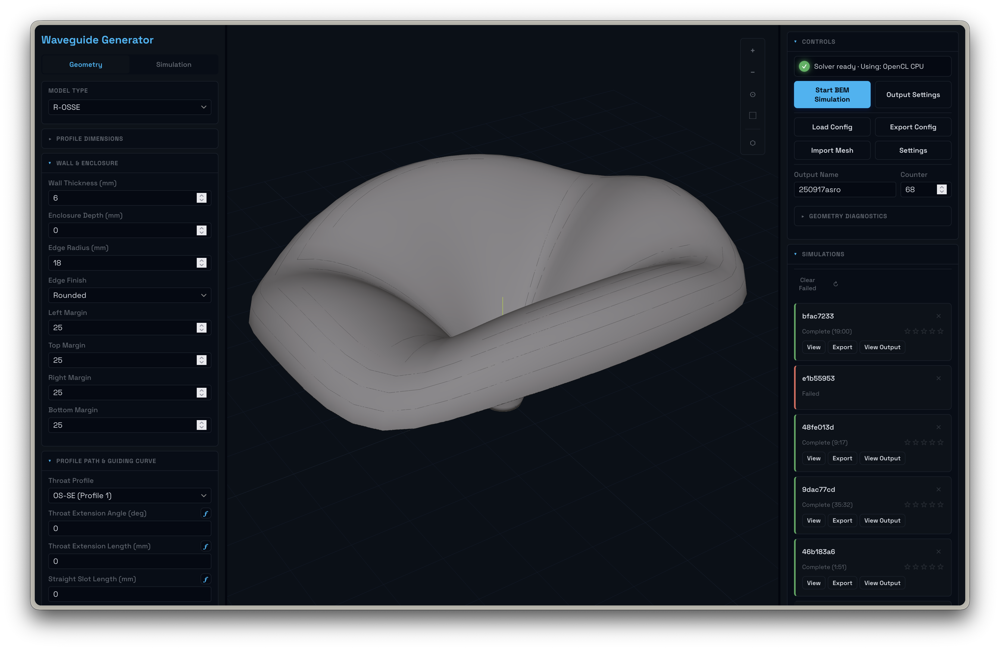

# Waveguide Generator

A browser-based tool for designing acoustic horns — live 3D preview, parameter controls, BEM simulation, and file exports for manufacturing and simulation workflows.



## Documentation

| Document                                               | Purpose                                 |
| ------------------------------------------------------ | --------------------------------------- |
| [Architecture](docs/architecture.md)                   | Durable layer and contract overview     |
| [Module Contracts](docs/modules/README.md)             | Stable module boundaries and invariants |
| [Project Documentation](docs/PROJECT_DOCUMENTATION.md) | Runtime reference and API details       |
| [Testing Guide](tests/TESTING.md)                      | Test map, commands, and diagnostics     |
| [Backlog](docs/backlog.md)                             | Active unfinished work                  |
| [Archive](docs/archive/README.md)                      | Historical plans and reports            |

## Get the project files

Choose one method:

- **Git users**:
  ```bash
  git clone https://github.com/m3gnus/waveguide-generator.git
  cd waveguide-generator
  ```
- **No Git (ZIP download)**:
  1. Open [github.com/m3gnus/waveguide-generator](https://github.com/m3gnus/waveguide-generator)
  2. Click **Code** → **Download ZIP**
  3. Extract the ZIP completely
  4. Open the extracted folder (usually `waveguide-generator-main`)

The **project folder** means the folder that contains `package.json`.

## Prerequisites

Two things need to be installed on your computer before you begin:

- **[Node.js 18+](https://nodejs.org/)** — download and install the LTS version
- **[Python 3.10 - 3.14](https://www.python.org/downloads/)** — on Windows, tick _"Add python.exe to PATH"_ during install

That's all. Everything else is handled by the setup script.

## Install

Run this **once** from the project folder to install all dependencies:

- **Windows** — double-click `install/install.bat`
- **macOS / Linux** — run:
  ```bash
  bash install/install.sh
  ```

These setup scripts validate that you are in the full project folder before installing dependencies.
The installer checks your environment, installs all dependencies, and sets up a Python virtual environment. It now automatically attempts to install both `gmsh` and `bempp-cl`, with fallback handling if platform wheels are missing.
Installer contract: setup writes the preferred backend interpreter to `.waveguide/backend-python.path` (default: project `.venv`), and `npm start` / launchers / `server/start.sh` consume that same marker unless you explicitly override with `PYTHON_BIN` or `WG_BACKEND_PYTHON`.

## Run the app

**macOS** — double-click `launch/mac.command`
**Windows** — double-click `launch\windows.bat`
**Linux** — run `bash launch/linux.sh`

The app opens automatically in your browser at `http://localhost:3000`. Close the terminal window to stop it.

## BEM Solver (Optional)

The setup script attempts to install `bempp-cl` automatically. If it fails, the app still works for 3D preview and local STL/config/profile exports — only the **Start BEM Simulation** feature requires it.

**Dependency matrix:**

- Python: `>=3.10,<3.15`
- gmsh: `>=4.11,<5.0` (required for `/api/mesh/build`)
- bempp-cl: `>=0.4,<0.5` (required for `/api/solve`)

The maintained runtime only supports `bempp-cl` for `/api/solve`; there is no legacy `bempp_api` fallback path.

Manual install:

```bash
# macOS / Linux
.venv/bin/pip install git+https://github.com/bempp/bempp-cl.git

# Windows
.venv\Scripts\python.exe -m pip install git+https://github.com/bempp/bempp-cl.git
```

## Gmsh Install Fallback

Setup first tries default package indexes for `gmsh>=4.11,<5.0`. If that fails, it retries with official gmsh snapshot indexes from [gmsh.info](https://gmsh.info/). If all retries fail, setup exits with an error.

Manual retry:

```bash
# macOS / Linux
.venv/bin/pip install --pre --extra-index-url https://gmsh.info/python-packages-dev -r server/requirements-gmsh.txt

# Headless Linux (no X11)
.venv/bin/pip install --pre --extra-index-url https://gmsh.info/python-packages-dev-nox -r server/requirements-gmsh.txt

# Windows
.venv\Scripts\python.exe -m pip install --pre --extra-index-url https://gmsh.info/python-packages-dev -r server\requirements-gmsh.txt
```

## OpenCL Setup (macOS Apple Silicon)

For macOS Apple Silicon, use the OpenCL CPU helper:

```bash
./scripts/setup-opencl-backend.sh
```

This creates a dedicated environment at `$HOME/.waveguide-generator/opencl-cpu-env/`.
The helper updates `.waveguide/backend-python.path` so launcher and backend startup use the OpenCL environment by default for this repo.

**Other platforms:**

- **Windows/Linux**: OpenCL GPU setup depends on vendor drivers (NVIDIA/AMD/Intel).
- **Linux CPU fallback**: Install `pocl-opencl-icd` via your package manager.

## Features

- **Geometry**: R-OSSE and OSSE horn profile generation with live parameter controls
- **3D Rendering**: Real-time viewport with standard, zebra, wireframe, and curvature modes
- **Simulation**: BEM workflow with backend job submission, progress tracking, and result plotting
- **Polar Directivity**: Horizontal, vertical, and diagonal axes with ATH-compatible inclination mapping
- **Exports**: STL, CSV profiles, MWG config text, simulation mesh (.msh), and VACS-style results
- **Task Management**: Folder workspace routing, task-history ratings, auto-export on completion, and simulation diagnostics

## Mesh Control Guide

| Control                                      | Affects                                   | Does not affect                           |
| -------------------------------------------- | ----------------------------------------- | ----------------------------------------- |
| `Viewport * Segs` + `Throat Slice Density`   | Three.js preview tessellation             | Backend OCC mesh, `.msh` artifact quality |
| `Solve * Resolution` + enclosure resolutions | Backend OCC mesh and `.msh` artifacts     | Three.js triangle count                   |
| `Auto-download solve mesh`                   | Whether `.msh` is downloaded after solve  | Mesh generation itself                    |
| `Task Exports` settings                      | Export bundle formats for completed tasks | Solver execution                          |

**Note:** Imported ATH `Mesh.Quadrants` values do not trim the canonical simulation payload. The frontend and active backend solve path both run full-domain geometry for BEM; imported quadrant metadata remains informational unless a future solver path is added.

## Project layout

```
src/          Frontend app modules (geometry, export, simulation, viewer, UI)
server/       FastAPI backend and solver code
tests/        Frontend and integration tests (Node test runner)
server/tests/ Backend unittest suites
scripts/      Dev utilities
install/      One-time setup scripts (mac/linux and windows)
launch/       Double-click launchers (mac, windows, linux)
docs/         Architecture and technical reference
```

## Development

```bash
npm test              # JS tests in tests/
npm run test:server   # Python backend tests
npm run build         # Production bundle
```

See [CONTRIBUTING.md](CONTRIBUTING.md) for setup and contribution guidelines.

## Troubleshooting

**Backend not connected** — start the app via a launcher or `npm start`, then check:

```bash
curl http://localhost:8000/health
```

**Backend meshing/runtime checks**:

```bash
python3 -c "import gmsh; print(gmsh.__version__)"
gmsh -version
curl http://localhost:8000/health
```

**macOS: "cannot be opened because the developer cannot be verified"** — right-click `launch/mac.command` → Open → click Open in the security dialog.

**Wrong folder / missing `package.json`** — run setup from the extracted project root (the folder containing `package.json`). Use `install/install.bat` or `bash install/install.sh` from that folder.

**`npm ci` says `package-lock.json` is missing** — make sure you extracted or cloned the full project folder before running `install/install.bat` or `bash install/install.sh`. If the lockfile is missing, the installer falls back to `npm install`, but re-downloading a complete project copy is recommended.

**Python not found on Windows** — reinstall Python from [python.org](https://www.python.org/downloads/windows/) and tick _"Add python.exe to PATH"_.

**Windows shows Python but installer still fails** — open Command Prompt and run `py -0p` to inspect installed interpreters. If the detected path is under `WindowsApps`, disable `python.exe` / `python3.exe` aliases in:
`Settings > Apps > Advanced app settings > App execution aliases`.

**bempp-cl install is slow** — this is normal. The first install can take several minutes.

## Acknowledgments

- [AT-Horns](https://at-horns.eu/)
- [bempp-cl](https://github.com/bempp/bempp-cl)
- [Gmsh](https://gmsh.info/)

## License

MIT — see [LICENSE](LICENSE).
