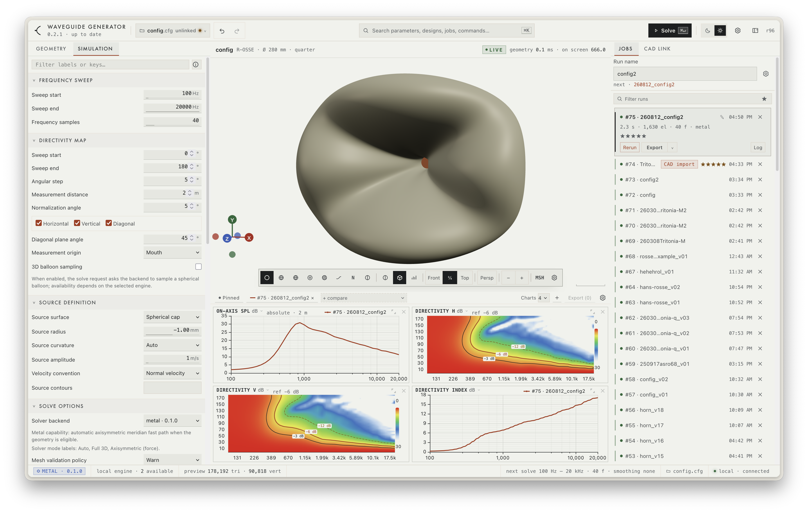

# Waveguide Generator

Interactive 3D design and BEM simulation for acoustic waveguides — a
from-scratch rebuild of the Waveguide Generator application on a TypeScript/React
frontend and a FastAPI backend, with the mesher as the single geometry authority.
This is the second-generation rewrite, historically called v2, and replaces the
original application.



The [documentation index](docs/README.md) separates the user and development guides,
current contracts, accepted design gates, legacy notes, and dated validation evidence.

## Install

Clone the repository — do not download a ZIP, because the installer updates
itself with Git and the pinned HornLab modules are installed from Git too.
Then run the installer for your platform:

| | |
|---|---|
| macOS | double-click `installers/macos/install-wg.command` |
| Windows | double-click `installers\windows\install-and-update.bat` |
| Linux | `bash installers/linux/install.sh` |

For a self-contained macOS install, download the release's **Waveguide
Generator-…-macos-arm64.dmg**, open it, and drag **Waveguide Generator** to
Applications. The app is ad-hoc signed rather than notarized, so on first launch
macOS may require **System Settings → Privacy & Security → Open Anyway** and a
confirmation; later launches work normally.

It fast-forwards the checkout, downloads that version's prebuilt interface from
the GitHub release and **refuses to extract it unless it matches the published
SHA-256**, creates `.venv` with CPython 3.13 and the locked dependency set,
checks that a solve can actually run, and starts the app. On macOS and Windows
it also installs the exact compatible WGLink source into Fusion 360 and reuses
WG's environment for spline resampling; users need no add-in checkout or second
virtual environment. Running the installer again updates WG's managed copy but
preserves a developer-managed WGLink registration. The exact source, integrity,
and takeover rules are in the [WGLink packaging contract](integrations/wglink/README.md).

Prerequisites, all reported with the command that installs them: CPython 3.13
(exactly — the dependency set is locked against one series), Git 2.20+, the
Microsoft Visual C++ Redistributable on Windows, and the Xcode Command Line
Tools on Apple Silicon for the Metal solver.

Useful flags: `--tag vX.Y.Z` installs a specific release, `--skip-spa` leaves
`frontend/dist` alone while you are working on the interface, `--no-launch`
stops before starting the app, and `--force` rebuilds the environment.
`--skip-wglink` leaves Fusion untouched; `--replace-wglink` deliberately
replaces a developer-managed copy; and `--wglink-archive PATH` rehearses an
already-built, provenance-checked package without fetching its source.

To check the solve backends at any time without a full install:

```
.venv/bin/python scripts/check_backends.py
```

### Uninstall

```
bash installers/macos/uninstall.sh         # macOS: also its managed WGLink copy
bash installers/linux/uninstall.sh         # Linux: same options
installers\windows\uninstall.bat            # Windows: also its managed WGLink copy
# Add --data to also remove designs, job history, meshes, and logs.
```

Neither touches the checkout itself — delete the folder yourself when you are
done with it.

## Launch

The launchers open a compact status window with separate backend and frontend
lamps, the local URL, an **Open in browser** button, and a **Quit** button. Quit
or close the window to stop the complete server process tree.

| | |
|---|---|
| macOS | open `launchers/macos/Waveguide Generator.app` |
| Windows | double-click `launchers\windows\launch-wg.bat` |
| Linux | `./launchers/linux/launch-wg.sh` |

The macOS app is deliberately unsigned. The first time, Control-click (or
right-click) **Waveguide Generator.app**, choose **Open**, then confirm **Open**.
After that, normal double-clicks work. If macOS still blocks it, open
**System Settings → Privacy & Security** and choose **Open Anyway** for the app.

The repository root intentionally has no duplicate install or launch scripts;
use the platform folders above. On first launch the entry creates `.venv` with
CPython 3.13 and installs the locked dependencies.

On macOS and Windows, append `--window` to the command launcher to open the
interface in one native desktop window instead of the tkinter status window.
Closing that window stops the owned server. `--browser` explicitly keeps the
normal status-window/browser workflow. Linux does not offer the native window
in this release; `--window` reports that limitation and falls back to the
status window.

For the original plain-terminal behavior, append `--no-gui`:

```
./launchers/macos/launch-wg.command --no-gui
./launchers/linux/launch-wg.sh --no-gui
launchers\windows\launch-wg.bat --no-gui
```

The launcher uses the first available port from 3100 through 3109. Advanced
server flags such as `--port`, `--no-browser`, and `--data-dir` can be appended.
The committed app icon is reproducible with
`python launchers/macos/generate_icon.py` on macOS; the generator uses only the
standard library and validates the resulting ICNS container with `iconutil`.

### When the status window does not open

The application and the status window fail independently. The window is drawn
with tkinter, which belongs to the Python installation rather than to Waveguide
Generator, so a Python without a working Tk gives an application that runs
perfectly under `--no-gui` and a window that never appears. Reinstalling
Waveguide Generator cannot change that, in either direction.

When the window cannot open, WG writes a full diagnosis to `statusapp.log` in
the application log directory and, on Windows, shows the cause and the remedy in
a dialog. The diagnosis names the interpreter it actually used, lists the Tk
files it looked for, and distinguishes the three causes, which have three
different fixes:

| What the report says | What it means |
|---|---|
| does not include tkinter | that Python was installed without Tk, or the launcher is using a different Python from the one you added Tk to |
| Tcl/Tk libraries could not be loaded | Tk is installed; something is stopping it loading. Re-ticking the installer option changes nothing |
| Tk loaded but failed to create a window | usually `TCL_LIBRARY` or `TK_LIBRARY` set by other software, or no interactive desktop session |

The same report can be produced on demand, which is the quickest thing to ask
for from a machine you cannot reach:

On Windows:

```
.venv\Scripts\python.exe launchers\statusapp\diagnostics.py
```

On macOS and Linux:

```
./.venv/bin/python launchers/statusapp/diagnostics.py
```

It exits 0 when the window can open. A machine with no graphical session at all
is reported as such and is not treated as a fault.

### Application updates

The version in the top-left corner checks GitHub's latest published full
release after the interface opens. When a newer, complete release is available
it turns amber and says **update available**. Click **Install update** to close
WG, run the verified platform installer, and restart automatically. The dialog
also retains the exact local installer command as a manual fallback. The same
action is available from the command palette as **Application update**.

WG caches successful checks, retries incomplete releases quickly, and keeps the
last known result when the network is unavailable. It also inspects the local
checkout without changing it: modified, development, detached, and non-Git
installs are explained instead of being handed an action that would silently do
the wrong thing. Automatic installation is available when WG was opened through
its status window. For a copied command, close Waveguide Generator first so the
installer can acquire the application data lock.

### Output workspace

Manual and automatic run exports default to the `output/` folder inside the
Waveguide Generator checkout. This folder is user-visible and does not require
browser download permission or approval for a protected operating-system data
directory. A different output folder can be selected once in **Settings →
Workspace**. Internal databases, logs, and process locks remain under the
platform application-data directory; result exports do not.

The Fusion WGLink exchange folder is configured separately under **Settings →
CAD Link**. Changing the output folder never moves or disconnects Fusion's
`.wglink` and `.wgreturn` exchange.

### Original-app run migration

On launch, Waveguide Generator looks for the original application's v1 run
database in an upgraded checkout and in sibling checkout folders. When it finds
one, it automatically merges its runs, results, mesh artifacts, and saved
workspace into the current data directory before the server starts. The v1
database is opened read-only, the current data is backed up first, existing
current-version runs win on an ID collision, and content hashes are verified
before startup continues. A completion marker makes later launches no-ops;
additional v1 runs are picked up if the source database changes.

For a v1 checkout stored somewhere else, set `WG1_ROOT` to that checkout before
launching. The manual dry-run, reporting, and rollback interface remains
available:

```
.venv/bin/python scripts/migrate_v1.py --v1-root "/path/to/v1 checkout" --dry-run
.venv/bin/python scripts/migrate_v1.py --rollback "/path/to/migration backup"
```

## Run the server directly (dev)

```
python3.13 scripts/bootstrap.py
.venv/bin/python launch/serve.py --port 3100
```

The bootstrap is idempotent: unchanged, valid environments do not contact the
package index. Run `.venv/bin/python scripts/bootstrap.py --check` to validate
without installing, or use `--force` to reinstall the locked dependency set.

## Headless evaluation

The installer also provisions a repository-aware `wg` command in `.venv/bin` on
macOS/Linux and `.venv\Scripts` on Windows. It validates or solves `.mwg`/`.cfg`
designs and accepts the same strict JSON `SolveRequest` as the HTTP API:

```text
.venv/bin/wg validate design.mwg --json
.venv/bin/wg solve --request request.json --events ndjson --output run-001
```

See the canonical [CLI contract](docs/reference/CLI.md) and
[external evaluation API](docs/reference/EXTERNAL-EVALUATION.md). A standard-library
[reference client](examples/external_evaluator.py) demonstrates persistent HTTP use.

Flags: `--no-browser`, `--data-dir` (or `WG2_DATA_DIR`); `WG2_ENABLE_DRYRUN=1` exposes the dry-run engine (dev/test only).

## Test commands

Python: `.venv/bin/python -m pytest server/tests -q`

JS frame codec (explicit file path — directory mode trips the node runner): `node --test shared/js/frame.test.mjs`

Frontend: `cd frontend && npm ci && npm test && npm run build`

Real solves are never run in hosted CI; Metal and bempp parity run on owned
qualification hardware, and their archived reports back the release gates. Use
the [solver release qualification checklist](docs/validation/SOLVER-QUALIFICATION.md)
for the mandatory macOS, Windows, full/quarter, and cross-solver runs.

## Releasing

Versions are plain `MAJOR.MINOR.PATCH`. The application is still being built,
so it stays **pre-1.0**: the line is `0.MINOR.PATCH`, a minor for features and a
patch for fixes, and 1.0.0 is reserved for the first release that is no longer a
beta. The original application is a separate, retired 1.x line, and nothing
resolves this project by version, so the two never collide.

The version lives in `shared/version.json` — `/health` and the FastAPI metadata
read it at runtime, and Vite injects it into the SPA as `__WG2_VERSION__` at
build time. npm keeps two further copies in `frontend/package.json` and
`frontend/package-lock.json`, and the macOS app has two bundle-version keys, so
move all of them with one command rather than by hand:

```bash
python scripts/bump_version.py patch
```

`major` and `minor` do the obvious thing, `--set X.Y.Z` sets an exact version,
and `--check` proves every copy agrees. CI runs `--check` on every push; so does
`server/tests/test_version_consistency.py`.

Then commit, and tag:

```bash
git tag v0.2.1 && git push origin v0.2.1
```

The tag fires `.github/workflows/release.yml`, which **refuses to build when the
tag disagrees with `shared/version.json`** — a build that misreports itself is
worse than a failed release. It then attaches the prebuilt SPA as
`waveguide-generator-v2-spa-<version>.tar.gz` with a `.sha256` beside it, so
installing Waveguide Generator needs no Node runtime.

Pre-release and build-metadata suffixes are deliberately unsupported: the tag is
built as `v` + this string, and the installer and update check compare it.

## License

AGPL-3.0-or-later. See [LICENSE](LICENSE). The pinned HornLab solver, mesher,
and plotting modules are separate repositories referenced by commit SHA in
[pins.json](pins.json), and all are AGPL-3.0-or-later with one exception:
`hornlab-beat-bem` is **GPL-3.0-or-later**, because it vendors the
Burton-Miller Julia solver from [boundary-lab](https://github.com/m3gnus/boundary-lab).
GPL-3 and AGPL-3 are mutually compatible, but the BEAT engine's terms are its
own and stay with that repository — which is why it is pinned rather than
vendored here.

WGLink is packaged from the separate AGPL-3.0-or-later
`hornlab-fusion-addin` repository at the full commit recorded in
[`integrations/wglink/source.json`](integrations/wglink/source.json). Its
upstream license and per-file source provenance travel in every installed
package.
