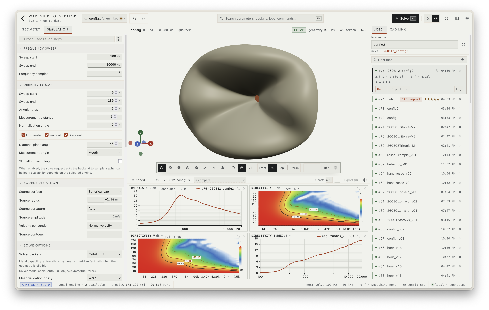

# Waveguide Generator

Waveguide Generator designs loudspeaker waveguides and horns, and predicts how
they will sound. You shape the waveguide in a live 3D view, then run an
acoustic simulation that shows its frequency response, directivity and
impedance.



## What you can do with it

- **Design.** Start from a ready-made profile (OSSE, R-OSSE, ICW or freeform),
  or open an existing ATH `.cfg` file. The 3D view updates as you change the
  numbers.
- **Simulate.** Run a solve on your computer. It uses the graphics card when
  it can and the processor when it can't. You don't need to pick a solver,
  because the app picks the fastest one that works on your machine.
- **Compare results.** Look at on-axis response, polar maps, directivity,
  impedance and power response. Keep several runs side by side, and export
  plots and data.
- **Finish the speaker in Fusion.** Send a waveguide to Autodesk Fusion with
  CAD Link, add a baffle, ports or a driver there, and solve the finished
  speaker. See the [CAD Link guide](docs/CAD-LINK-GUIDE.md).

Everything runs locally. Your designs never leave your computer.

## Install

Download the file for your system from the
[latest release](https://github.com/m3gnus/waveguide-generator/releases/latest)
and open it.

| System | Download | Then |
|---|---|---|
| macOS (Apple silicon) | `…-macos-arm64.dmg` | Drag the app to Applications and open it. |
| Windows 10/11 | `…-windows-x86_64-setup.exe` | Run it. If SmartScreen warns you, click **More info → Run anyway**. |
| Linux (Ubuntu 24.04) | `…-linux-x86_64.tar.gz` | Extract it and run `./install.sh`. |

The app is free and isn't signed with a paid Apple or Microsoft certificate.
That's why both systems warn you the first time. The warning is about the
missing certificate, not about anything found in the app.

**On macOS, the first launch is blocked.** macOS says it "could not verify"
the app and only offers **Done** and **Move to Bin**. Click **Done**. Then
open **System Settings → Privacy & Security**, scroll to Security, and click
**Open Anyway**. You only do this once.

The disk image also contains `Install Waveguide Generator.command`. You can
open that instead. It is approved the same way, then copies the app to
Applications for you. If Privacy & Security doesn't list either one, move the
app to Applications and run this once in Terminal:

```bash
xattr -dr com.apple.quarantine "/Applications/Waveguide Generator.app"
```

Need more detail, such as installing from a Git checkout, Linux system
libraries, or the portable Windows ZIP? See the
[install guide](docs/INSTALL.md).

## Updates

When a new version is out, the version number in the top-left corner turns
amber and says **update available**. Click it, then **Install update**. The app
checks the download, swaps it in and restarts. If anything goes wrong, it
rolls back to the version you had.

## Where your files go

Exported results are saved in `Documents/Waveguide Generator/runs`. You can
choose a different folder in **Settings → Workspace**.

## Uninstall

- **macOS:** drag the app to the Bin.
- **Windows:** use **Settings → Apps**, like any other program.
- **Linux:** run `uninstall.sh` in `~/.local/share/waveguide-generator`.

If you installed from a Git checkout, run `bash installers/macos/uninstall.sh`,
`bash installers/linux/uninstall.sh` or `installers\windows\uninstall.bat`.
Add `--data` to any of them to also delete your designs and job history.

## Learn more

- [User guide](docs/USER-GUIDE.md): the interface, solvers and results.
- [CAD Link guide](docs/CAD-LINK-GUIDE.md): finishing a speaker in Fusion.
- [Install guide](docs/INSTALL.md): every install option, launcher flags and
  troubleshooting.
- [Documentation index](docs/README.md): everything else.

**For developers:** the [development guide](docs/DEVELOPMENT.md) covers the
code layout and tests. The [release guide](docs/RELEASING.md) covers versions
and publishing. There is also a command-line tool, `wg`, for running designs
without the interface; see the [CLI reference](docs/reference/CLI.md).

## License

AGPL-3.0-or-later. See [LICENSE](LICENSE).

The solver, mesher and plotting modules live in separate HornLab repositories,
pinned by commit in [pins.json](pins.json). They are AGPL-3.0-or-later too,
except `hornlab-beat-bem`, which is **GPL-3.0-or-later** because it includes
the solver from [boundary-lab](https://github.com/m3gnus/boundary-lab). The two
licenses are compatible. The Fusion add-in (WGLink) comes from the
AGPL-3.0-or-later `hornlab-fusion-addin` repository, at the commit recorded in
[`integrations/wglink/source.json`](integrations/wglink/source.json).
