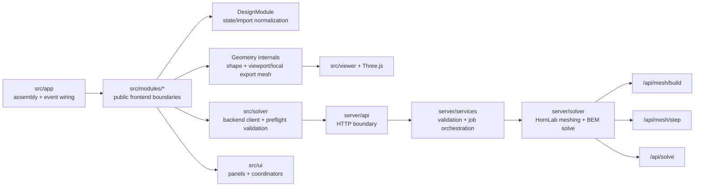

# Project Documentation

**This is the canonical implementation reference.** If code and docs disagree, update this file to match the code.

**Companion references**:

- `docs/architecture.md` — durable architecture, layer boundaries, design decisions
- `docs/modules/` — per-module contracts and responsibilities
- `tests/TESTING.md` — test inventory and run commands
- `server/README.md` — backend setup, API, dependency matrix
- `AGENTS.md` — multi-agent coding guardrails

## 1. Scope

**What it does**:

- Parametric horn geometry (OSSE / R-OSSE) with real-time Three.js viewport
- BEM simulation via backend solver (frequency-domain acoustic FEM/BEM coupling)
- HornLab mesher `.msh` and STEP generation (Gmsh-backed, server-side)
- Export to STL, single-layer STEP surface, CSV, MWG config, and result bundles (PNG, CSV, JSON, polar data, VACS, etc.)
- Task history with folder-workspace persistence and auto-export automation

**Entry points**:

- Frontend: `src/main.js` → `src/app/App.js`
- Backend: `server/app.py` (FastAPI on port 8000)

## 2. Runtime Architecture

### 2.1 Frontend

- `src/app/`
  - App orchestration, event wiring, scene lifecycle
- `src/geometry/`
  - Formula evaluation, viewport/local-export mesh topology generation, tag assignment, and internal canonical payload helpers
- `src/modules/`
  - Staged facades for design prep, geometry, export, simulation, and UI coordination
  - `DesignModule` is the app-facing boundary for state/type -> prepared parameter normalization
  - `DesignModule` also owns backend mesh request normalization helpers used by `ExportModule` and `SimulationModule`
  - `GeometryModule` prepares geometry-shape definitions only (no tessellation or payload assembly) and consumes already-prepared design params so geometry scale is applied exactly once
- `src/export/`
  - Active STL/profile/config export helpers plus HornLab mesher orchestration support
- `src/solver/`
  - Backend client and payload validation
- `src/ui/`
  - Parameter and simulation UI behavior, including schema-driven formula affordances in the parameter panel
  - `src/ui/parameterInventory.js` is the source of truth for parameter-section grouping/order across geometry, sweep, directivity placement, source, and mesh sections
  - `src/ui/helpAffordance.js` renders the shared hover-help trigger used by schema-driven controls and the directivity panel
  - The settings modal groups persistent preferences into `Viewer`, `Simulation`, `Task Exports`, `Workspace`, and `System`, and those rows reuse the shared help-trigger pattern
- `src/state.js`
  - Global app state, undo/redo, persistence

### 2.2 Backend

- `server/app.py`
  - FastAPI app assembly, router registration, lifecycle wiring
- `server/contracts/`
  - Shared Pydantic request/response contracts consumed by routes, services, and backend tests
- `server/api/routes_simulation.py`
  - Simulation/job routes (`/api/solve`, `/api/status/{job_id}`, `/api/results/{job_id}`, `/api/jobs*`) that map HTTP semantics onto the public job-runtime service boundary
- `server/api/routes_mesh.py`
  - Mesh routes (`/api/mesh/build`, `/api/mesh/step`, `/api/mesh/viewport`)
- `server/api/routes_misc.py`
  - Misc routes (`/`, `/health`, `/api/updates/check`, chart/directivity rendering)
- `server/services/job_runtime.py`
  - Public job lifecycle service surface plus the in-memory job cache, queue, scheduler loop, and DB merge helpers it owns
- `server/services/solver_runtime.py`
  - Service-layer adapter for solver availability flags, dependency status, HornLab mesher access, and device metadata
- `server/services/simulation_runner.py`
  - Async single-job execution and persistence flow
- `server/services/simulation_validation.py`
  - Domain validation helpers for `/api/solve` request semantics and backend mesh requirements
- `server/services/update_service.py`
  - Git-backed update status checks
- `server/solver/mesher_adapter.py`
  - HornLab mesher request adapter for solver/export `.msh`, STEP surface export, and fast viewport geometry (point grids + enclosure rings, no Gmsh)
- `server/solver/mesh.py`
  - Canonical payload integrity checks and BEM mesh loading/validation helpers
- `server/solver/bem_solver.py`, `server/solver/solve.py`
  - BEM solve pipeline (single stable runtime entrypoint)
- `server/solver/deps.py`
  - Runtime dependency/version gating

### 2.3 Overview Diagram



## 3. Core Flows

### 3.1 Render flow

1. UI parameter updates mutate `GlobalState`.
2. `App` schedules render.
3. `src/app/scene.js` fetches `POST /api/mesh/viewport` (HornLab mesher point grids + enclosure profile rings, no Gmsh) and tessellates them with `src/geometry/viewportTessellator.js`; while a fetch is in flight the previous mesh stays on screen.
4. Returned mesh is rendered in Three.js. The viewport path detaches crease vertices before normal generation so hard seams (mouth rim, baffle, source cap) keep crisp shading without affecting backend solve/export meshes.
5. When the backend is unreachable, the scene falls back to the in-browser JS engine (`DesignModule` → `GeometryModule` → `buildGeometryMeshFromShape`) and retries the backend after a cooldown.

### 3.2 Simulation flow

1. Simulation UI emits `simulation:mesh-requested`.
2. `src/app/mesh.js` emits a minimal HornLab solve contract placeholder mesh. It does not build a JavaScript geometry mesh for solve submission.
3. `BemSolver.submitSimulation(...)` posts payload to `POST /api/solve` with HornLab mesh strategy:
   - `options.mesh.strategy = "hornlab_mesher"`

- `options.mesh.waveguide_params = WaveguideParamsRequest-compatible payload`
- Simulation settings forward `mesh_validation_mode`, `frequency_spacing`, and `verbose` when the saved values are valid
- Simulation settings forward `solver_backend` (`auto`, `metal`) as the public backend selector. Both values resolve to the Metal BEM backend; `hornlab-metal-bem` is the only solve backend.
- Solver runtime availability details come from `/health` metadata in results/status surfaces, while active Simulation settings expose only stable public overrides
- Metal BEM requires Apple Silicon macOS. On other hosts `/health` reports the solver as unavailable while mesh building and exports keep working.
- On-axis and polar observation distance now share one effective value, and the backend pushes that value forward if the requested point would land inside or too close to the enclosure/horn geometry.
- Completed solve payloads persist both `metadata.observation` and `metadata.directivity`, so downstream UI can read the effective observation distance and the actual polar-map settings without reconstructing them from saved form state. `metadata.directivity` includes both `enabled_axes` and normalized `planes`, while `results.directivity` includes only the requested plane keys.

4. Frontend polls `GET /api/status/{job_id}` and reads `GET /api/results/{job_id}` on completion.
   - Frontend also reconciles against `GET /api/jobs` to restore queued/running/history state after reload.
   - Completed-task history uses explicit source modes: folder workspace selected = folder manifests/index only, otherwise backend jobs/local cache.
   - Completion polling marks a job as `justCompleted` only on the transition into `complete`; when Task Exports settings have auto-export enabled, the configured export bundle runs once for that completion and persists an `autoExportCompletedAt` marker with exported file tokens.
   - Task-list UI preferences persist through simulation-management settings and stay mirrored between the Simulation Jobs toolbar and the Settings modal: `defaultSort` drives stable job ordering and `minRatingFilter` gates visible rows, while per-task star ratings sync back into local job storage and folder manifests/index when available.
5. If backend solver/HornLab mesher runtime is unavailable, simulation start fails with an explicit runtime error (no mock fallback).

### 3.3 Export flow

1. Local file exports (`exportSTL`, `exportMWGConfig`, `exportProfileCSV`) run through `src/modules/export/useCases.js`.
2. HornLab mesher-backed mesh export uses `prepareExportArtifacts(...)`, which normalizes export params through `DesignModule` and requests `POST /api/mesh/build`.
3. STEP export uses `exportSTEP(...)`, which normalizes export params through `DesignModule` and requests `POST /api/mesh/step`.
4. If `/api/mesh/build` or `/api/mesh/step` returns `503`, the export path fails explicitly and does not fall back to a legacy frontend mesher.
5. Completed-task exports now run through a bundle coordinator in `src/ui/simulation/exports.js`, driven by persisted Task Exports settings (`autoExportOnComplete`, `selectedFormats`).
6. When a folder workspace is active, manual exports (STL/profile/config and other direct save-file flows) write into the selected folder root, while completed-task bundle files write into the task subfolder (`<workspace>/<jobId>/...`). Folder manifests/index still persist there for task-history restore, but the workspace is not a catch-all redirect for every generated artifact.
7. If direct folder writes fail or permission is lost, the app clears the selected workspace and falls back to the standard file-save/download behavior for the affected export.
8. ABEC bundle generation is not part of the active runtime; remaining ABEC compatibility is limited to config/result text conventions used by import/export helpers.

## 4. Mesh Pipelines

### 4.1 JS viewport/local-export geometry pipeline

Primary files:

- `src/geometry/engine/*`
- `src/geometry/pipeline.js`
- `src/geometry/tags.js`

`buildGeometryArtifacts(...)` returns internal geometry artifacts for viewport/local exports and regression checks:

- `geometry` shape definition used as tessellation input
- `mesh` for render/export helpers
- `simulation` canonical payload with tags/BC metadata for non-runtime contract checks
- `export` helpers (ATH coordinate transform)

Canonical surface tags:

- `1` = wall
- `2` = source
- `3` = secondary domain (reserved in JS canonical runtime)
- `4` = interface (reserved in JS canonical runtime)

Important behavior:

- Source triangles are explicit geometry and required; payload build throws if none are tagged.
- JS canonical payload helpers currently emit only tags `1` and `2`; tag counters for `3`/`4` remain zero in regression tests.
- Runtime solve submission does not use JS mesh topology; HornLab mesher solve/export requests may use selected or auto-resolved `quadrants`.
- Raw geometry helpers prepare params at the API boundary, while module pipelines use prepared-only entrypoints to avoid double-scaling.
- `scale` affects horn geometry dimensions only; enclosure fields (`encDepth`, `encEdge`, `encSpaceL/T/R/B`) remain absolute millimeter values in the JS geometry pipeline.
- Imported ATH `Mesh.Quadrants` values populate the visible solve/export control. Auto can replace it with a conservatively detected symmetry domain.
- `/api/solve` still validates the minimal contract mesh shape, including source tag `2`, but the actual solve mesh is generated from HornLab waveguide parameters.
- Backend mesher output passes canonical mesh `surfaceTags` through unchanged; later stages validate contracts rather than collapsing non-source tags into `1`.
- Adaptive phi tessellation is restricted to full-circle horn-only render usage.
- The frontend solve payload is a minimal validation placeholder; active simulation meshing is HornLab mesher in backend.

### 4.2 HornLab mesher parameter-to-`.msh` pipeline (`/api/mesh/build`)

Frontend call path:

- `src/modules/export/useCases.js` -> `prepareExportArtifacts(...)`

Backend implementation:

- `server/api/routes_mesh.py` route `POST /api/mesh/build`
- `server/solver/mesher_adapter.py` function `build_waveguide_mesh(...)`

Frontend request normalization:

  - Backend mesh request normalization is owned by `DesignModule`:
  - `DesignModule.output.backendMeshSimulationParams(...)` normalizes simulation mesh inputs (min/rounded segment counts, canonical quadrants, mesh-resolution defaults).
  - `DesignModule.output.backendMeshExportParams(...)` adds export-specific mesh normalization (angular snapping to multiples of 4 and scaled/coarse export resolutions).
  - Legacy `occSimulationParams(...)` and `occExportParams(...)` aliases were removed; backend mesh callers must use HornLab mesher names.
  - `buildWaveguidePayload(...)` maps already-normalized backend mesh fields to request schema and enforces payload shape for required fields.

Response shape:

```json
{
  "msh": "...",
  "generatedBy": "hornlab-waveguide-mesher",
  "stats": { "nodeCount": 0, "elementCount": 0 },
  "stl": "...optional..."
}
```

Validation/gating:

- `formula_type` must be `"R-OSSE"` or `"OSSE"` (`422` otherwise)
- `msh_version` must be `"2.2"` or `"4.1"` (`422` otherwise)
- Returns `503` when Python/gmsh runtime matrix is unsupported or HornLab mesher unavailable

Backend geometry logic:

- `enc_depth > 0`: enclosure geometry generated
- `enc_depth == 0` and `wall_thickness > 0`: freestanding wall shell generated
- both zero: bare horn
- `sim_type` does not control geometry generation in HornLab mesher
- `subdomain_slices` / `interface_*` fields are accepted in request payload but are not currently used to create interface geometry

HornLab mesher resolution semantics:

- `throat_res`: nominal element size at throat plane.
- `mouth_res`: nominal element size at mouth plane.
- Horn surfaces use smooth axial interpolation `throat_res -> mouth_res`.
- `rear_res`: rear-wall size for freestanding thickened horns (no enclosure).
- `enc_front_resolution` / `enc_back_resolution`:
  comma list (`q1,q2,q3,q4`) or scalar broadcast for enclosure front/back baffle corners.
  Quadrant mapping: `Q1(+x,+y)`, `Q2(-x,+y)`, `Q3(-x,-y)`, `Q4(+x,-y)`.

UI control mapping:

- Surface sample controls affect live JS viewport/local export tessellation and the HornLab mesher sampling input.
- `Throat/Mouth/Rear Mesh Resolution`, `Front/Rear Baffle Mesh Resolution`, and `Export Vertical Offset` affect HornLab mesher solve/export mesh density or coordinates; they do not change the active JS viewport triangle count.
- `Auto-download solve mesh artifact (.msh)` affects only whether the persisted backend `.msh` artifact is downloaded.

Physical groups written by HornLab mesher:

- tag 1: `SD1G0`
- tag 2: `SD1D1001`
- tag 3: `SD2G0` (when exterior surfaces exist)

## 5. Export System

### 5.1 UI-exposed exports

Active runtime export surfaces:

- App-level exports: STL (`exportSTL`), MWG config text (`exportMWGConfig`), and profile/slice CSV (`exportProfileCSV`)
- Simulation-result exports: bundle-coordinated PNG / CSV / JSON / text / polar CSV / impedance CSV / VACS / STL / Fusion CSV task exports in `src/ui/simulation/exports.js`
- Completed-job mesh download: `.msh` artifact fetch via `src/ui/simulation/meshDownload.js` when backend jobs persist mesh artifacts

Task-history controls:

- `src/ui/simulation/jobActions.js` renders inline 1-5 star rating controls and applies persisted sort/filter preferences.
- `src/ui/settings/simulationManagementSettings.js` stores task export settings plus task-list preferences (`defaultSort`, `minRatingFilter`) used by the `Task Exports` settings section and Simulation Jobs toolbar.
- `src/ui/simulation/controller.js` persists rating updates through the same job/task-manifest contract used for export bookkeeping.

ABEC bundle export is removed from the active runtime. The live solver path is fully backend-driven via `/api/solve`.

### 5.2 CSV profile/slice export

`exportProfileCSV` in `src/modules/export/useCases.js` builds a bare horn-surface mesh from the prepared design export grid and writes two CSV files via `src/export/profiles.js`. It does not read the viewport mesh, because viewport rendering uses display-only resampling and crease vertex duplication.

- **`_profiles.csv`**: For each angular position (fixed phi), lists all points from throat to mouth along the horn axis. Sections separated by blank lines.
- **`_slices.csv`**: For each axial position (fixed z), lists all points around the circumference (closing back to phi=0). Sections separated by blank lines.

Format: `x;y;z` (semicolon-delimited, no header), scaled by 0.1 (matching ATH `GridExport` convention). Coordinates are x=r·cos(phi), y=r·sin(phi), z=axial.

The mesh builder normalizes `angularSegments` to the nearest compatible multiple (via `normalizeAngularSegments` in `src/geometry/engine/mesh/angles.js`). The export must use this normalized ring count as the vertex stride, not the raw config value.

Regression coverage: `tests/csv-export.test.js`

### 5.3 Internal/library export utilities

Additional export utilities in `src/export/*` are limited to active STL / CSV / config helpers; the old direct frontend `.msh` helper is now quarantined under `tests/helpers/legacyMsh.js` for regression-only use. The HornLab mesher runtime export flow remains backend-meshed and Gmsh-authored.

## 6. Backend API Contract

Base URL: `http://localhost:8000`

- `GET /`
  - Basic service metadata and solver availability flag

- `GET /health`
  - Health status + dependency matrix/runtime payload from `deps.py`
  - Includes `dependencyDoctor` summary + component guidance for frontend runtime-warning dialogs and blocked-feature messaging:
    - `summary.requiredReady`
    - `summary.requiredIssues`
    - `summary.solveReady`
    - `summary.solveIssues`
    - `components[].id|name|category|status|requiredFor|featureImpact|guidance`
    - Doctor components: `fastapi`, `gmsh_python`, `hornlab_waveguide_mesher`, `hornlab_metal_bem` (required; `/api/solve`), `metal_release_helper` (Apple Silicon only), `matplotlib` (optional)
  - Frontend solver UI only surfaces dependency guidance when required components are missing; healthy dependency state is not rendered as a persistent status panel.
  - Reports solver readiness: `solver` (`metal-bem` | `unavailable`), `solverReady`, and `solverBackends.metal` (`{ ready, status }`; metal is the only backend entry)
  - Includes `capabilities` metadata for frontend settings gating:
    - `simulationBasic.controls`
    - `simulationAdvanced.available`
    - `simulationAdvanced.controls` (`solver_backend`)
    - `simulationAdvanced.reason`
    - `simulationAdvanced.plannedControls`
    - `solverBackends.backends` (`metal` only)

- `GET /api/updates/check`
  - Git remote/update check against `origin`

- `POST /api/mesh/build`
  - Input: `WaveguideParamsRequest` payload (ATH-style params)
  - Output: `{ msh, generatedBy: "hornlab-waveguide-mesher", stats, stl? }`
  - Note: does not return `.geo`

- `POST /api/solve`
  - Validates mesh array lengths and `surfaceTags` triangle parity
  - Validates `sim_type == "2"` (infinite-baffle path currently deferred)
  - Supports HornLab mesher simulation meshing through `options.mesh.strategy="hornlab_mesher"`
    with required `options.mesh.waveguide_params`
  - Supports `polar_config.enabled_axes` (`horizontal|vertical|diagonal`, at least one required)
    and `polar_config.inclination` (diagonal plane angle)
  - Returns `results.directivity` as a plane-keyed map that includes only the requested enabled axes; frontend/export consumers must not assume all three plane keys are always present
  - Supports `mesh_validation_mode` (`strict`, `warn`, `off`)
  - Supports `solver_backend` (`auto` | `metal`; both resolve to the Metal BEM backend). `solver_backend: "bempp"` is rejected with `422` because the bempp solver backend was removed.
  - Accepts compatibility `device_mode` and `advanced_settings` fields for older/non-frontend callers, but ignores them in the active `/api/solve` runtime path
  - Creates async job and returns `{ job_id }`
  - Backend schedules jobs FIFO with `max_concurrent_jobs=1` by default

- `GET /api/jobs`
  - Lists jobs with optional `status` filter and `limit`/`offset` pagination
  - Returns compact job metadata, status/progress/stage timestamps, `has_results`/`has_mesh_artifact`, and persisted `mesh_stats`
  - `mesh_stats` is the authoritative solve-mesh summary for HornLab mesher jobs, including vertex/triangle counts plus canonical tag counts and mesher-derived face-identity triangle counts

- `DELETE /api/jobs/{job_id}`
  - Deletes terminal jobs (`complete|error|cancelled`)
  - Returns `409` for active jobs (`queued|running`)

- `POST /api/stop/{job_id}`
  - Cancels queued/running job
  - Queued jobs become `cancelled` immediately
  - Running jobs stay `running` with stage `cancelling` until the worker acknowledges the stop request

- `GET /api/status/{job_id}`
  - Returns status/progress
  - Running-stage contract is intentionally collapsed to core phases: `initializing` → `mesh_prepare` → `bem_solve` → `finalizing` (plus terminal/cancellation stages)
  - Stage metadata carries cancellation progress (`cancelling`) while a running stop request is still being acknowledged

- `GET /api/results/{job_id}`
  - Returns results for completed jobs

## 7. Solver Runtime and Dependency Matrix

Runtime-gated matrix in `server/solver/deps.py`:

| Component           | Supported range | Required for      |
| ------------------- | --------------- | ----------------- |
| Python              | `>=3.10,<3.15`  | backend runtime   |
| HornLab mesher      | `2eb7b85e16952b2854ae0cadb661b87c4ad02313` | `/api/mesh/build` |
| HornLab Metal BEM   | `59528f5a0993ff4718d9037baae5fac008705b0c` | `/api/solve` (only solve backend; Apple Silicon macOS) |
| gmsh Python package | `>=4.11,<5.0`   | `/api/mesh/build` |

Notes:

- Backend runtime still accepts `use_optimized` for compatibility, but it is ignored; the active runtime always executes the stable solver entrypoint.
- Solver internals normalize mesh coordinates to meters before BEM assembly.
- `hornlab-metal-bem` is the only solve backend; it requires Apple Silicon macOS. Mesh building and exports work on all platforms.
- The public advanced solver surface exposes solver backend selection only (`solver_backend`: `auto` | `metal`); Metal BEM uses its own native solver settings.

### 7.1 Solver performance metadata

Every `/api/solve` result includes `metadata.performance` with the minimum fields required by the active UI:

| Field                | Type   | Description                                                           |
| -------------------- | ------ | --------------------------------------------------------------------- |
| `total_time_seconds` | float  | Wall time for the full solve                                          |
| `bem_precision`      | string | Active solver operator precision (`single` in the stable runtime path) |

Note: Internal benchmark scripts may log additional timing details during solve, but only `total_time_seconds` and `bem_precision` are part of the public result contract.

## 8. Canonical Contract

This section is normative for the current runtime contract. It absorbs the Phase 0 contract freeze that was previously kept in `docs/CANONICAL_CONTRACT.md`.

### 8.1 Classification layers

#### Geometry face identity

Canonical identity vocabulary preserved by the cleanup:

- Freestanding thickened horn:
  - `inner_wall`
  - `outer_wall`
  - `mouth_rim`
  - `throat_return`
  - `rear_cap`
  - `throat_disc`
- Horn with enclosure:
  - `horn_wall`
  - `throat_disc`
  - `enc_front`
  - `enc_side`
  - `enc_rear`
  - `enc_edge`

Runtime status:

- The JS geometry engine emits explicit subsets for `inner_wall`, `outer_wall`, `mouth_rim`, `throat_return`, `rear_cap`, `horn_wall`, `throat_disc`, `enc_front`, `enc_side`, `enc_rear`, and `enc_edge`.
- `src/geometry/tags.js` maps those identities deterministically to mesh sizing classes and solver boundary classes.
- JS geometry outer-build selection is exclusive: enclosure (`encDepth > 0`) or freestanding shell (`encDepth == 0 && wallThickness > 0`) or bare horn.
- JS enclosure generation is OSSE-only; `R-OSSE` with `encDepth > 0` is rejected.
- When `encEdge > 0`, JS enclosure generation adds front and rear axial roundover strips in addition to the rounded/chamfered sidewall corners; `enc_edge` covers those roundover strips.
- JS freestanding wall thickness is generated from local 3D horn-surface normals and keeps the outer throat ring at the same axial station as the inner throat ring.
- The freestanding wall `throat_return` subset is the rear transition from that throat-side outer ring into the back plate; the back plate sits `wallThickness` behind the throat plate and the transition follows the outer back-side slope instead of a straight cylinder.
- JS morphing derives implicit target extents from each current slice when `morphTarget` is active but `morphWidth` / `morphHeight` are unset.

#### Mesh sizing classes

Mesh sizing classes are meshing semantics only, not solver boundary-condition semantics:

- `horn_inner_axial`
- `horn_rear_domain`
- `throat_source_region`
- `enclosure_front`
- `enclosure_rear`
- `enclosure_edge`

Runtime status:

- JS runtime maps geometry identities to logical `MESH_SIZING_CLASS` constants via `src/geometry/tags.js`.
- HornLab meshing uses numeric resolution fields directly (`throat_res`, `mouth_res`, `rear_res`, `enc_front_resolution`, `enc_back_resolution`).

#### Solver boundary classes

- `RIGID_WALL`
- `ACOUSTIC_SOURCE`
- `IMPEDANCE_APERTURE` (reserved)
- `SYMMETRY` (reserved)

Runtime status:

- Active frontend/runtime submission classes are `RIGID_WALL` and `ACOUSTIC_SOURCE`.
- `throat_disc` maps to `ACOUSTIC_SOURCE`.
- All non-source triangles map to `RIGID_WALL`.

### 8.2 Numeric tag contract

Shared numeric tag vocabulary:

- `1` = wall (`SD1G0`)
- `2` = source (`SD1D1001`)
- `3` = secondary domain (`SD2G0`)
- `4` = interface (`I1-2`)

Runtime behavior by pipeline:

- JS canonical payload helpers (`src/geometry/pipeline.js`, `src/geometry/tags.js`) emit only tags `1` and `2` in regression coverage.
- HornLab mesh build output (`/api/mesh/build`) emits tags `1`, `2`, and optional `3` when exterior surfaces exist.
- Neither active JS runtime nor active HornLab mesh build emits tag `4`.
- HornLab mesher `/api/solve` preserves selected symmetry-reduced `quadrants` and passes canonical `surfaceTags` through to solver mesh preparation unchanged.

Required invariants:

- `surfaceTags.length === indices.length / 3`
- At least one source-tagged triangle (`2`) must exist before solve submission.

### 8.3 Frontend solve payload decision

- The frontend solve payload is a minimal numeric-tag placeholder: `vertices`, `indices`, and `surfaceTags` satisfy the current `/api/solve` request schema.
- Face-identity diagnostics for completed jobs come from backend HornLab mesher stats, not from a frontend-generated solve mesh.
- HornLab meshing consumes prepared waveguide parameters only; it does not consume frontend geometry tessellation.

### 8.4 Authoritative normalization spec

#### Angular segments

- Geometry mesh generation (`src/geometry/engine/buildWaveguideMesh.js`, `src/geometry/engine/mesh/angles.js`):
  - Round to integer.
  - Minimum `4`.
  - If not divisible by `4`, snap up to the nearest multiple of `8` for ring construction.
- Backend mesh simulation request normalization (`src/modules/design/index.js`):
  - `prepareBackendMeshSimulationParams(...)` sets `angularSegments = max(20, round(value))`.
- Backend mesh export request normalization (`src/modules/design/index.js`):
  - `prepareBackendMeshExportParams(...)` snaps angular segments to multiples of `4` with minimum `20`.
- Waveguide payload mapping (`src/solver/waveguidePayload.js`):
  - Expects already-normalized integer `angularSegments`, maps it to `n_angular`, and throws on missing/invalid backend-mesh fields instead of normalizing locally.

#### Length segments

- Geometry mesh generation rounds to integer and uses minimum `1` for internal tessellation.
- Backend mesh simulation/export normalization (`src/modules/design/index.js`) sets `lengthSegments = max(10, round(value))`.
- Waveguide payload mapping (`src/solver/waveguidePayload.js`) expects already-normalized integer `lengthSegments`, maps it to `n_length`, and throws on missing/invalid backend-mesh fields instead of normalizing locally.

#### Quadrants

- Frontend backend-mesh request normalization (`src/modules/design/index.js`) accepts canonical values `1`, `12`, `14`, `1234`; otherwise it attempts numeric coercion and falls back to `1234`.
- A UI Auto action samples prepared angular parameters and enclosure/offset constraints to choose `1`, `12`, `14`, or `1234` conservatively.
- Waveguide payload mapping (`src/solver/waveguidePayload.js`) expects normalized integer `quadrants` and maps it directly.
- `/api/solve` validates the HornLab mesher request and preserves normalized `quadrants` in the queued solve request.
- Simulation runner forwards queued backend mesh `quadrants` to HornLab mesh generation.

#### Enclosure resolution fields

- Frontend backend mesh payload fields `enc_front_resolution` and `enc_back_resolution` are strings.
- Defaults are `"25,25,25,25"` and `"40,40,40,40"`.
- Defaults are applied by `prepareBackendMeshSimulationParams(...)` and `prepareBackendMeshExportParams(...)`; enclosure mesh resolutions remain absolute millimetre values when horn `scale` changes.
- `buildWaveguidePayload(...)` forwards the values as strings and requires the fields to be present.

#### Unit metadata

- Frontend solve placeholder metadata identifies the placeholder source. Full unit metadata comes from backend mesher stats/results.
- HornLab mesher solve enriches mesh metadata with the same unit contract.

### 8.5 Frontend solve placeholder shape

Minimal mesh object sent to `/api/solve`:

```json
{
  "vertices": [0.0, 0.0, 0.0, 1.0, 0.0, 0.0, 0.0, 1.0, 0.0],
  "indices": [0, 1, 2],
  "surfaceTags": [2],
  "format": "msh",
  "boundaryConditions": {
    "throat": { "type": "velocity", "surfaceTag": 2, "value": 1.0 },
    "wall": { "type": "neumann", "surfaceTag": 1, "value": 0.0 },
    "mouth": { "type": "robin", "surfaceTag": 1, "impedance": "spherical" }
  },
  "metadata": {
    "source": "hornlab_mesher_contract_placeholder",
    "viewportOnly": false
  }
}
```

Optional directivity payload for `/api/solve`:

```json
{
  "polar_config": {
    "angle_range": [0, 180, 37],
    "norm_angle": 5,
    "distance": 2,
    "inclination": 45,
    "enabled_axes": ["horizontal", "vertical", "diagonal"]
  }
}
```

Validation points:

- Frontend: `src/solver/index.js` (`validateCanonicalMeshPayload`)
- Backend request validation: `server/api/routes_simulation.py`
- Backend mesh integrity checks: `server/solver/mesh.py`
- Backend results surface failures in `metadata.failures`, `metadata.failure_count`, and `metadata.partial_success`

### 8.6 Contract lock tests

Primary tests that lock this contract:

- `tests/mesh-payload.test.js`
- `tests/geometry-artifacts.test.js`
- `tests/waveguide-payload.test.js`
- `server/tests/test_api_validation.py`

## 9. Testing and Verification

Canonical inventory and test-location map: `tests/TESTING.md`.

Primary commands:

- `npm test`
- `npm run test:server`
- `npm run build`

High-signal test suites:

- Geometry/tagging: `tests/mesh-payload.test.js`, `tests/geometry-artifacts.test.js`, `tests/enclosure-regression.test.js`, `tests/geometry-quality.test.js`, `tests/morph-implicit-target.test.js`
- Export/HornLab mesher pipeline: `tests/export-gmsh-pipeline.test.js`, `tests/polar-settings.test.js`
- Backend contracts: `server/tests/test_dependency_runtime.py`, `server/tests/test_api_validation.py`, `server/tests/test_solver_tag_contract.py`, `server/tests/test_directivity_plot.py`

## 10. Operational Notes and Constraints

- Frontend dev server: `http://localhost:3000` (`scripts/dev-server.js`)
- Backend API server: `http://localhost:8000` (`server/app.py`)
- Combined startup script: `npm start` (`scripts/start-all.js`)
- Backend preflight command (selected interpreter): `npm run preflight:backend`
- Strict backend preflight command: `npm run preflight:backend:strict`
- Metal native release helper build/check command: `npm run build:metal-helper`
- Backend dependency doctor command (selected interpreter): `npm run doctor:backend`
- Backend dependency doctor JSON payload: `npm run doctor:backend:json`
- Strict backend dependency doctor command: `npm run doctor:backend:strict`
- Backend interpreter selection contract for `npm start` and `server/start.sh`:
  1. `PYTHON_BIN`
  2. `WG_BACKEND_PYTHON`
  3. repo marker `.waveguide/backend-python.path` (written by install/setup scripts)
  4. fallback probe across project `.venv`, a legacy `$HOME/.waveguide-generator/opencl-cpu-env/bin/python` interpreter when present, then `python3`
  5. if no fallback candidate is runtime-ready, keep the same raw fallback order
- Backend jobs are in-memory; restarting backend clears job history.
- gmsh Python API calls are guarded for thread-safety and main-thread constraints.

### Solver runtime availability

`hornlab-metal-bem` is the only solve backend and requires Apple Silicon macOS. If the Metal BEM runtime is unavailable, `/health` reports `solver: "unavailable"` with `solverBackends.metal.status` carrying the reason, and `/api/solve` rejects submissions; mesh building and exports keep working on all platforms. On Apple Silicon, the runtime doctor/preflight also require the Swift release helper (`metal_release_helper`); build or repair it with `npm run build:metal-helper`.

## 11. Key File Map

- App orchestration: `src/app/App.js`
- Scene/render path: `src/app/scene.js`
- Simulation mesh provider: `src/app/mesh.js`
- Geometry artifacts/payload: `src/geometry/pipeline.js`
- Surface tag rules: `src/geometry/tags.js`
- Export use cases: `src/modules/export/useCases.js`
- Simulation panel controller/store: `src/ui/simulation/controller.js`
- Simulation job orchestration helpers: `src/ui/simulation/jobOrchestration.js`
- Polar UI/helpers: `src/ui/simulation/polarSettings.js`
- FastAPI app wiring: `server/app.py`
- Simulation routes: `server/api/routes_simulation.py`
- Mesh routes: `server/api/routes_mesh.py`
- Misc routes: `server/api/routes_misc.py`
- Job runtime scheduler/state: `server/services/job_runtime.py`
- Simulation runner: `server/services/simulation_runner.py`
- HornLab mesher: `server/solver/mesher_adapter.py`
- Directivity render: `server/solver/directivity_plot.py`
- Solver dependency matrix: `server/solver/deps.py`
