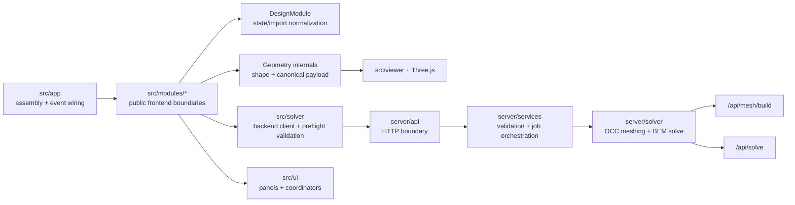

# Waveguide Generator: Project Documentation

This document describes the current implementation in this repository.
If code and docs disagree, update this file to match runtime behavior.

Companion docs:
- `docs/architecture.md` for durable system-level architecture
- `docs/modules/README.md` for stable per-module contracts
- `docs/backlog.md` for active unfinished work

Active backlog:
- `docs/backlog.md`

Historical cleanup record:
- `docs/archive/ARCHITECTURE_CLEANUP_PLAN_2026-03-11.md`

## 1. Scope and Entry Points

Waveguide Generator is a browser-based horn design tool with:
- Parametric OSSE / R-OSSE geometry generation
- Real-time Three.js rendering
- Canonical mesh payload generation for BEM simulation
- Backend meshing and solve APIs (FastAPI + gmsh + bempp)
- STL / profile CSV / MWG config export workflows plus task-bundle result export automation

Primary entry points:
- Frontend boot: `src/main.js`
- Frontend coordinator: `src/app/App.js`
- Backend API: `server/app.py`

## 2. Runtime Architecture

### 2.1 Frontend

- `src/app/`
  - App orchestration, event wiring, scene lifecycle
- `src/geometry/`
  - Formula evaluation, mesh topology generation, tag assignment, canonical payload assembly
- `src/modules/`
  - Staged facades for design prep, geometry, export, simulation, and UI coordination
  - `DesignModule` is the app-facing boundary for state/type -> prepared parameter normalization
  - `DesignModule` also owns OCC request normalization helpers used by `ExportModule` and `SimulationModule`
  - `GeometryModule` prepares geometry-shape definitions only (no tessellation or payload assembly)
- `src/export/`
  - Active STL/profile/config export helpers plus OCC mesh-build orchestration support
- `src/solver/`
  - Backend client and payload validation
- `src/ui/`
  - Parameter and simulation UI behavior, including schema-driven formula affordances in the parameter panel
  - `src/ui/parameterInventory.js` is the source of truth for parameter-section grouping/order across geometry, sweep, directivity placement, source, and mesh sections
  - `src/ui/helpAffordance.js` renders the shared hover-help trigger used by schema-driven controls and the directivity panel
  - The settings modal groups persistent preferences into `Viewer`, `Simulation`, `Task Exports`, `Workspace`, and `System`, and those rows reuse the shared help-trigger pattern
- `src/state.js`
  - Global app state, undo/redo, persistence

### 2.2 Backend

- `server/app.py`
  - FastAPI app assembly, router registration, lifecycle wiring
- `server/contracts/`
  - Shared Pydantic request/response contracts consumed by routes, services, and backend tests
- `server/api/routes_simulation.py`
  - Simulation/job routes (`/api/solve`, `/api/status/{job_id}`, `/api/results/{job_id}`, `/api/jobs*`) that map HTTP semantics onto the public job-runtime service boundary
- `server/api/routes_mesh.py`
  - Mesh routes (`/api/mesh/build`)
- `server/api/routes_misc.py`
  - Misc routes (`/`, `/health`, `/api/updates/check`, chart/directivity rendering)
- `server/services/job_runtime.py`
  - Public job lifecycle service surface plus the in-memory job cache, queue, scheduler loop, and DB merge helpers it owns
- `server/services/solver_runtime.py`
  - Service-layer adapter for solver availability flags, dependency status, OCC builder access, and device metadata
- `server/services/simulation_runner.py`
  - Async single-job execution and persistence flow
- `server/services/simulation_validation.py`
  - Domain validation helpers for `/api/solve` request semantics and OCC shell requirements
- `server/services/update_service.py`
  - Git-backed update status checks
- `server/solver/waveguide_builder.py`
  - OCC-based mesh construction from ATH parameters (`/api/mesh/build`)
- `server/solver/mesh.py`
  - Canonical payload integrity checks and optional gmsh refinement
- `server/solver/bem_solver.py`, `solve.py`, `solve_optimized.py`
  - BEM solve pipeline and optimized path
- `server/solver/deps.py`
  - Runtime dependency/version gating

### 2.3 Overview Diagram



## 3. Core Flows

### 3.1 Render flow

1. UI parameter updates mutate `GlobalState`.
2. `App` schedules render.
3. `src/app/scene.js` resolves prepared design inputs via `DesignModule`, gets a geometry shape from `GeometryModule`, then tessellates it for viewport rendering.
4. Returned mesh is rendered in Three.js. The viewport path may detach `throat_disc` vertices before normal generation so the source cap keeps a crisp render seam without changing the canonical simulation payload.

### 3.2 Simulation flow

1. Simulation UI emits `simulation:mesh-requested`.
2. `src/app/mesh.js` resolves prepared design inputs via `DesignModule`, and `SimulationModule` builds canonical payload from those inputs before emitting `simulation:mesh-ready`.
   - For OCC-adaptive `/api/solve`, frontend may send imported `waveguide_params.quadrants`, but that does not trim the canonical simulation payload. The backend submission boundary still builds a queued full-domain OCC request with `quadrants=1234`.
   - The same pre-submit payload also carries `metadata.identityTriangleCounts`, which the UI uses to show geometry-face triangle counts without changing the downstream numeric `surfaceTags` solver contract.
3. `BemSolver.submitSimulation(...)` posts payload to `POST /api/solve` with adaptive mesh strategy:
   - `options.mesh.strategy = "occ_adaptive"`
- `options.mesh.waveguide_params = WaveguideParamsRequest-compatible payload`
- Simulation settings forward `device_mode`, `mesh_validation_mode`, `frequency_spacing`, `use_optimized`, `enable_symmetry`, and `verbose` when the saved values are valid
- Settings runtime capability checks reuse the last `/health` snapshot from startup polling and refresh again when the Settings modal opens
- Auto policy priority is deterministic: `opencl_gpu -> opencl_cpu`
- On GPU-only OpenCL runtimes without a CPU device, `opencl_gpu` now installs a bempp-cl CPU-context surrogate that reuses the active GPU context for singular assembly.
- On-axis and polar observation distance now share one effective value, and the backend pushes that value forward if the requested point would land inside or too close to the enclosure/horn geometry.
4. Frontend polls `GET /api/status/{job_id}` and reads `GET /api/results/{job_id}` on completion.
   - Frontend also reconciles against `GET /api/jobs` to restore queued/running/history state after reload.
   - Completed-task history uses explicit source modes: folder workspace selected = folder manifests/index only, otherwise backend jobs/local cache.
   - Completion polling marks a job as `justCompleted` only on the transition into `complete`; when Task Exports settings have auto-export enabled, the configured export bundle runs once for that completion and persists an `autoExportCompletedAt` marker with exported file tokens.
   - Task-list UI preferences persist through simulation-management settings and stay mirrored between the Simulation Jobs toolbar and the Settings modal: `defaultSort` drives stable job ordering and `minRatingFilter` gates visible rows, while per-task star ratings sync back into local job storage and folder manifests/index when available.
  - Solver results now include both `metadata.symmetry` (applied reduction summary) and `metadata.symmetry_policy` (decision/rejection reason, detected type/planes, reduction factor, and centered-source check).
  - The Simulation Jobs feed persists a compact symmetry summary alongside each job, combining the requested `enable_symmetry` setting with the fetched solver decision once results are available.
5. If backend solver/OCC runtime is unavailable, simulation start fails with an explicit runtime error (no mock fallback).

### 3.3 Export flow

1. Local file exports (`exportSTL`, `exportMWGConfig`, `exportProfileCSV`) run through `src/modules/export/useCases.js`.
2. OCC-backed mesh export uses `prepareExportArtifacts(...)`, which normalizes export params through `DesignModule` and requests `POST /api/mesh/build`.
3. If `/api/mesh/build` returns `503`, the export path fails explicitly and does not fall back to a legacy frontend mesher.
4. Completed-task exports now run through a bundle coordinator in `src/ui/simulation/exports.js`, driven by persisted Task Exports settings (`autoExportOnComplete`, `selectedFormats`).
5. When a folder workspace is active, manual exports (STL/profile/config and other direct save-file flows) write into the selected folder root, while completed-task bundle files write into the task subfolder (`<workspace>/<jobId>/...`). Folder manifests/index still persist there for task-history restore, but the workspace is not a catch-all redirect for every generated artifact.
6. If direct folder writes fail or permission is lost, the app clears the selected workspace and falls back to the standard file-save/download behavior for the affected export.
7. ABEC bundle generation is not part of the active runtime; remaining ABEC compatibility is limited to config/result text conventions used by import/export helpers.

## 4. Mesh Pipelines

### 4.1 JS canonical geometry/payload pipeline

Primary files:
- `src/geometry/engine/*`
- `src/geometry/pipeline.js`
- `src/geometry/tags.js`

`buildGeometryArtifacts(...)` returns:
- `geometry` shape definition used as tessellation input
- `mesh` for render/export helpers
- `simulation` canonical payload with tags/BC metadata
- `export` helpers (ATH coordinate transform)

Canonical surface tags:
- `1` = wall
- `2` = source
- `3` = secondary domain (reserved in JS canonical runtime)
- `4` = interface (reserved in JS canonical runtime)

Important behavior:
- Source triangles are explicit geometry and required; payload build throws if none are tagged.
- JS canonical payload currently emits only tags `1` and `2`; tag counters for `3`/`4` remain zero in runtime tests.
- Simulation payload topology is full-domain and does not trim by `quadrants`.
- OCC-adaptive `/api/solve` builds a full-domain queued OCC request with `quadrants=1234` at the submission boundary instead of mutating the caller-owned request in place.
- Imported ATH `Mesh.Quadrants` values therefore remain import metadata only; whether a run stays full-domain or reduces to half/quarter domain is decided later by `metadata.symmetry_policy` in the solve path.
- `/api/solve` rejects mesh payloads that do not already contain source tag `2`, instead of waiting for solver-side mesh preparation to fail.
- The OCC runner passes canonical mesh `surfaceTags` through unchanged; later stages validate contracts rather than collapsing non-source tags into `1`.
- Adaptive phi tessellation is restricted to full-circle horn-only render usage.
- The canonical frontend payload remains a validation/contract artifact; active simulation meshing is OCC-adaptive in backend.

### 4.2 OCC parameter-to-`.msh` pipeline (`/api/mesh/build`)

Frontend call path:
- `src/modules/export/useCases.js` -> `prepareExportArtifacts(...)`

Backend implementation:
- `server/api/routes_mesh.py` route `POST /api/mesh/build`
- `server/solver/waveguide_builder.py` function `build_waveguide_mesh(...)`

Frontend request normalization:
- OCC request normalization is owned by `DesignModule`:
  - `DesignModule.output.occSimulationParams(...)` normalizes simulation OCC inputs (min/rounded segment counts, canonical quadrants, mesh-resolution defaults).
  - `DesignModule.output.occExportParams(...)` adds export-specific OCC normalization (angular snapping to multiples of 4 and scaled/coarse export resolutions).
  - `buildWaveguidePayload(...)` maps already-normalized OCC fields to request schema and enforces payload shape for required OCC fields.

Response shape:
```json
{
  "msh": "...",
  "generatedBy": "gmsh-occ",
  "stats": { "nodeCount": 0, "elementCount": 0 },
  "stl": "...optional..."
}
```

Validation/gating:
- `formula_type` must be `"R-OSSE"` or `"OSSE"` (`422` otherwise)
- `msh_version` must be `"2.2"` or `"4.1"` (`422` otherwise)
- Returns `503` when Python/gmsh runtime matrix is unsupported or OCC builder unavailable

OCC geometry logic:
- `enc_depth > 0`: enclosure geometry generated
- `enc_depth == 0` and `wall_thickness > 0`: freestanding wall shell generated
- both zero: bare horn
- `sim_type` does not control geometry generation in OCC builder
- `subdomain_slices` / `interface_*` fields are accepted in request payload but are not currently used to create OCC interface geometry

OCC mesh-resolution semantics:
- `throat_res`: nominal element size at throat plane.
- `mouth_res`: nominal element size at mouth plane.
- Horn surfaces use smooth axial interpolation `throat_res -> mouth_res`.
- `rear_res`: rear-wall size for freestanding thickened horns (no enclosure).
- `enc_front_resolution` / `enc_back_resolution`:
  comma list (`q1,q2,q3,q4`) or scalar broadcast for enclosure front/back baffle corners.
  Quadrant mapping: `Q1(+x,+y)`, `Q2(-x,+y)`, `Q3(-x,-y)`, `Q4(+x,-y)`.

UI control mapping:
- `Preview Angular/Length/Corner/Throat Segments` and `Preview Slice Bias` affect only Three.js preview tessellation.
- `Throat/Mouth/Rear Mesh Resolution`, `Front/Rear Baffle Mesh Resolution`, and `Export Vertical Offset` affect backend OCC solve/export mesh density or coordinates.
- `Auto-download solve mesh artifact (.msh)` affects only whether the persisted backend `.msh` artifact is downloaded.

Physical groups written by OCC builder:
- tag 1: `SD1G0`
- tag 2: `SD1D1001`
- tag 3: `SD2G0` (when exterior surfaces exist)

## 5. Export System

### 5.1 UI-exposed exports

Active runtime export surfaces:
- App-level exports: STL (`exportSTL`), MWG config text (`exportMWGConfig`), and profile/slice CSV (`exportProfileCSV`)
- Simulation-result exports: bundle-coordinated PNG / CSV / JSON / text / polar CSV / impedance CSV / VACS / STL / Fusion CSV task exports in `src/ui/simulation/exports.js`
- Completed-job mesh download: `.msh` artifact fetch via `src/ui/simulation/meshDownload.js` when backend jobs persist mesh artifacts

Task-history controls:
- `src/ui/simulation/jobActions.js` renders inline 1-5 star rating controls and applies persisted sort/filter preferences.
- `src/ui/settings/simulationManagementSettings.js` stores task export settings plus task-list preferences (`defaultSort`, `minRatingFilter`) used by the `Task Exports` settings section and Simulation Jobs toolbar.
- `src/ui/simulation/controller.js` persists rating updates through the same job/task-manifest contract used for export bookkeeping.

ABEC bundle export is removed from the active runtime. The live solver path is fully backend-driven via `/api/solve`.

### 5.2 CSV profile/slice export

`exportProfileCSV` in `src/modules/export/useCases.js` reads the viewport horn mesh and writes two CSV files via `src/export/profiles.js`:

- **`_profiles.csv`**: For each angular position (fixed phi), lists all points from throat to mouth along the horn axis. Sections separated by blank lines.
- **`_slices.csv`**: For each axial position (fixed z), lists all points around the circumference (closing back to phi=0). Sections separated by blank lines.

Format: `x;y;z` (semicolon-delimited, no header), scaled by 0.1 (matching ATH `GridExport` convention). Coordinates are x=r·cos(phi), y=r·sin(phi), z=axial.

The mesh builder normalizes `angularSegments` to the nearest compatible multiple (via `normalizeAngularSegments` in `src/geometry/engine/mesh/angles.js`). The export must use this normalized ring count as the vertex stride, not the raw config value.

Regression coverage: `tests/csv-export.test.js`

### 5.3 Internal/library export utilities

Additional export utilities in `src/export/*` are limited to active STL / CSV / config helpers plus legacy `.geo` tooling; the old direct frontend `.msh` helper is now quarantined under `tests/helpers/legacyMsh.js` for regression-only use. The OCC runtime export flow remains backend-meshed and Gmsh-authored.

## 6. Backend API Contract

Base URL: `http://localhost:8000`

- `GET /`
  - Basic service metadata and solver availability flag

- `GET /health`
  - Health status + dependency matrix/runtime payload from `deps.py`
  - Includes `capabilities` metadata for frontend settings gating:
    - `simulationBasic.controls`
    - `simulationAdvanced.available`
    - `simulationAdvanced.controls`
    - `simulationAdvanced.reason`
    - `simulationAdvanced.plannedControls`
  - Includes `deviceInterface` metadata for current device policy resolution:
    - `requested_mode`, `selected_mode`
    - `interface` (`opencl` when a device is selected)
    - `device_type` (`cpu` or `gpu`)
    - `device_name`
    - `fallback_reason`
    - `available_modes`
    - `mode_availability` (per-mode `available` + `reason`)
    - `opencl_diagnostics` (base/platform/cpu/gpu OpenCL detection details)

- `GET /api/updates/check`
  - Git remote/update check against `origin`

- `POST /api/mesh/build`
  - Input: `WaveguideParamsRequest` payload (ATH-style params)
  - Output: `{ msh, generatedBy: "gmsh-occ", stats, stl? }`
  - Note: does not return `.geo`

- `POST /api/solve`
  - Validates mesh array lengths and `surfaceTags` triangle parity
  - Validates `sim_type == "2"` (infinite-baffle path currently deferred)
  - Supports adaptive OCC simulation meshing through `options.mesh.strategy="occ_adaptive"`
    with required `options.mesh.waveguide_params`
  - Supports `polar_config.enabled_axes` (`horizontal|vertical|diagonal`, at least one required)
    and `polar_config.inclination` (diagonal plane angle)
  - Supports `mesh_validation_mode` (`strict`, `warn`, `off`)
  - Supports `device_mode` (`auto`, `opencl_cpu`, `opencl_gpu`)
  - Supports optimized-solver `advanced_settings`:
    - `enable_warmup`
    - `bem_precision` (`single` or `double`)
    - `use_burton_miller`
    - `symmetry_tolerance` (positive finite float)
  - Creates async job and returns `{ job_id }`
  - Backend schedules jobs FIFO with `max_concurrent_jobs=1` by default

- `GET /api/jobs`
  - Lists jobs with optional `status` filter and `limit`/`offset` pagination
  - Returns compact job metadata, status/progress/stage timestamps, `has_results`/`has_mesh_artifact`, and persisted `mesh_stats`
  - `mesh_stats` is the authoritative solve-mesh summary for adaptive OCC jobs, including vertex/triangle counts plus canonical tag counts and OCC-derived face-identity triangle counts

- `DELETE /api/jobs/{job_id}`
  - Deletes terminal jobs (`complete|error|cancelled`)
  - Returns `409` for active jobs (`queued|running`)

- `POST /api/stop/{job_id}`
  - Cancels queued/running job
  - Queued jobs become `cancelled` immediately
  - Running jobs stay `running` with stage `cancelling` until the worker acknowledges the stop request

- `GET /api/status/{job_id}`
  - Returns status/progress
  - Stage metadata carries cancellation progress (`cancelling`) while a running stop request is still being acknowledged

- `GET /api/results/{job_id}`
  - Returns results for completed jobs

## 7. Solver Runtime and Dependency Matrix

Runtime-gated matrix in `server/solver/deps.py`:

| Component | Supported range | Required for |
|---|---|---|
| Python | `>=3.10,<3.15` | backend runtime |
| gmsh Python package | `>=4.11,<5.0` | `/api/mesh/build` |
| bempp-cl | `>=0.4,<0.5` | `/api/solve` |

Notes:
- Backend solve path defaults to optimized solve mode (`use_optimized=True` in request model).
- Solver internals normalize mesh coordinates to meters before BEM assembly.
- Device policy defaults to `auto` with deterministic priority: `opencl_gpu`, then `opencl_cpu`.
- Startup auto benchmarking is disabled; mode resolution is based on runtime availability checks.
- Strong-form GMRES (`use_strong_form=True`) is enabled by default when the installed bempp runtime supports it (bempp-cl ≥ 0.4). Support is feature-detected once at import time.
- Public advanced solver overrides currently expose warm-up, BEM precision, Burton-Miller coupling, and symmetry tolerance. GMRES method/restart/tolerance/max-iteration and explicit strong-form policy controls remain outside the contract.
- The runtime requires `bempp-cl`; no legacy `bempp_api` compatibility lane remains in the maintained backend contract.

### 7.1 Solver performance metadata

Every `/api/solve` result includes `metadata.performance`:

| Field | Type | Description |
|---|---|---|
| `total_time_seconds` | float | Wall time for full solve |
| `frequency_solve_time` | float | Time spent in frequency loop |
| `directivity_compute_time` | float | Time for directivity post-processing |
| `time_per_frequency` | float | Average per-frequency solve time |
| `warmup_time_seconds` | float | Warm-up pass duration (0 if skipped) |
| `gmres_iterations_per_frequency` | list[int\|null] | GMRES iteration count per frequency; `null` for failed frequencies |
| `avg_gmres_iterations` | float | Mean iteration count across successful frequencies |
| `gmres_strong_form_supported` | bool | Whether strong-form preconditioner was active for this run |
| `bem_precision` | string | Active BEMPP operator precision for the optimized solve path (`single` or `double`) |
| `reduction_speedup` | float | Symmetry reduction factor applied (1.0 = no reduction) |

## 8. Canonical Contract

This section is normative for the current runtime contract. It absorbs the Phase 0 contract freeze that was previously kept in `docs/CANONICAL_CONTRACT.md`.

### 8.1 Classification layers

#### Geometry face identity

Canonical identity vocabulary preserved by the cleanup:

- Freestanding thickened horn:
  - `inner_wall`
  - `outer_wall`
  - `mouth_rim`
  - `throat_return`
  - `rear_cap`
  - `throat_disc`
- Horn with enclosure:
  - `horn_wall`
  - `throat_disc`
  - `enc_front`
  - `enc_side`
  - `enc_rear`
  - `enc_edge`

Runtime status:
- The JS geometry engine emits explicit subsets for `inner_wall`, `outer_wall`, `mouth_rim`, `throat_return`, `rear_cap`, `horn_wall`, `throat_disc`, `enc_front`, `enc_side`, `enc_rear`, and `enc_edge`.
- `src/geometry/tags.js` maps those identities deterministically to mesh sizing classes and solver boundary classes.
- JS geometry outer-build selection is exclusive: enclosure (`encDepth > 0`) or freestanding shell (`encDepth == 0 && wallThickness > 0`) or bare horn.
- JS enclosure generation is OSSE-only; `R-OSSE` with `encDepth > 0` is rejected.
- When `encEdge > 0`, JS enclosure generation adds front and rear axial roundover strips in addition to the rounded/chamfered sidewall corners; `enc_edge` covers those roundover strips.
- JS freestanding wall thickness is generated from local 3D horn-surface normals and keeps the outer throat ring at the same axial station as the inner throat ring.
- The freestanding wall `throat_return` subset is the rear transition from that throat-side outer ring into the back plate; the back plate sits `wallThickness` behind the throat plate and the transition follows the outer back-side slope instead of a straight cylinder.
- JS morphing derives implicit target extents from each current slice when `morphTarget` is active but `morphWidth` / `morphHeight` are unset.

#### Mesh sizing classes

Mesh sizing classes are meshing semantics only, not solver boundary-condition semantics:

- `horn_inner_axial`
- `horn_rear_domain`
- `throat_source_region`
- `enclosure_front`
- `enclosure_rear`
- `enclosure_edge`

Runtime status:
- JS runtime maps geometry identities to logical `MESH_SIZING_CLASS` constants via `src/geometry/tags.js`.
- OCC meshing uses numeric resolution fields directly (`throat_res`, `mouth_res`, `rear_res`, `enc_front_resolution`, `enc_back_resolution`).

#### Solver boundary classes

- `RIGID_WALL`
- `ACOUSTIC_SOURCE`
- `IMPEDANCE_APERTURE` (reserved)
- `SYMMETRY` (reserved)

Runtime status:
- Active frontend/runtime submission classes are `RIGID_WALL` and `ACOUSTIC_SOURCE`.
- `throat_disc` maps to `ACOUSTIC_SOURCE`.
- All non-source triangles map to `RIGID_WALL`.

### 8.2 Numeric tag contract

Shared numeric tag vocabulary:

- `1` = wall (`SD1G0`)
- `2` = source (`SD1D1001`)
- `3` = secondary domain (`SD2G0`)
- `4` = interface (`I1-2`)

Runtime behavior by pipeline:
- JS canonical simulation payload (`src/geometry/pipeline.js`, `src/geometry/tags.js`) emits only tags `1` and `2`.
- OCC mesh build output (`/api/mesh/build`) emits tags `1`, `2`, and optional `3` when exterior surfaces exist.
- Neither active JS runtime nor active OCC mesh build emits tag `4`.
- OCC-adaptive `/api/solve` requires full-domain queued OCC requests (`quadrants=1234`) and passes canonical OCC `surfaceTags` through to solver mesh preparation unchanged.

Required invariants:
- `surfaceTags.length === indices.length / 3`
- At least one source-tagged triangle (`2`) must exist before solve submission.

### 8.3 Frontend payload decision

- The frontend canonical payload remains numeric-tag-first: `vertices`, `indices`, and `surfaceTags` are the downstream simulation contract.
- Face identities remain available through `meshData.groups` and are mapped via `src/geometry/tags.js`.
- `metadata.identityTriangleCounts` preserves geometry-face triangle totals (`throat_disc`, `inner_wall`/`horn_wall`, enclosure faces, etc.) for UI diagnostics while leaving `surfaceTags` as the authoritative solver-facing tagging contract.
- OCC meshing consumes raw prepared parameters only; it does not consume a frontend-generated mesh contract.

### 8.4 Authoritative normalization spec

#### Angular segments

- Geometry mesh generation (`src/geometry/engine/buildWaveguideMesh.js`, `src/geometry/engine/mesh/angles.js`):
  - Round to integer.
  - Minimum `4`.
  - If not divisible by `4`, snap up to the nearest multiple of `8` for ring construction.
- OCC simulation request normalization (`src/modules/design/index.js`):
  - `prepareOccSimulationParams(...)` sets `angularSegments = max(20, round(value))`.
- OCC export request normalization (`src/modules/design/index.js`):
  - `prepareOccExportParams(...)` snaps angular segments to multiples of `4` with minimum `20`.
- Waveguide OCC payload mapping (`src/solver/waveguidePayload.js`):
  - Expects already-normalized integer `angularSegments`, maps it to `n_angular`, and throws on missing/invalid OCC-required fields instead of normalizing locally.

#### Length segments

- Geometry mesh generation rounds to integer and uses minimum `1` for internal tessellation.
- OCC simulation/export normalization (`src/modules/design/index.js`) sets `lengthSegments = max(10, round(value))`.
- Waveguide OCC payload mapping (`src/solver/waveguidePayload.js`) expects already-normalized integer `lengthSegments`, maps it to `n_length`, and throws on missing/invalid OCC-required fields instead of normalizing locally.

#### Quadrants

- Frontend OCC request normalization (`src/modules/design/index.js`) accepts canonical values `1`, `12`, `14`, `1234`; otherwise it attempts numeric coercion and falls back to `1234`.
- Waveguide OCC payload mapping (`src/solver/waveguidePayload.js`) expects normalized integer `quadrants` and maps it directly.
- `/api/solve` validates the OCC-adaptive request and builds the queued solve request with full-domain `quadrants=1234` at the submission boundary.
- Simulation runner rejects queued OCC requests that arrive with any non-`1234` quadrant value.

#### Enclosure resolution fields

- Frontend OCC payload fields `enc_front_resolution` and `enc_back_resolution` are strings.
- Defaults are `"25,25,25,25"` and `"40,40,40,40"`.
- Defaults and export scaling are applied by `prepareOccSimulationParams(...)` and `prepareOccExportParams(...)`.
- `buildWaveguidePayload(...)` forwards the values as strings and requires the fields to be present.

#### Unit metadata

- Canonical frontend simulation payload metadata is `units: "mm"` and `unitScaleToMeter: 0.001`.
- OCC-adaptive solve enriches mesh metadata with the same unit contract.

### 8.5 Frontend canonical payload shape

Frontend payload shape sent to `/api/solve`:

```json
{
  "vertices": [0.0, 0.0, 0.0],
  "indices": [0, 1, 2],
  "surfaceTags": [2],
  "format": "msh",
  "boundaryConditions": {
    "throat": { "type": "velocity", "surfaceTag": 2, "value": 1.0 },
    "wall": { "type": "neumann", "surfaceTag": 1, "value": 0.0 },
    "mouth": { "type": "robin", "surfaceTag": 1, "impedance": "spherical" }
  },
  "metadata": {
    "units": "mm",
    "unitScaleToMeter": 0.001
  }
}
```

Optional directivity payload for `/api/solve`:

```json
{
  "polar_config": {
    "angle_range": [0, 180, 37],
    "norm_angle": 5,
    "distance": 2,
    "inclination": 45,
    "enabled_axes": ["horizontal", "vertical", "diagonal"]
  }
}
```

Optional device selection payload for `/api/solve`:

```json
{
  "device_mode": "auto"
}
```

Validation points:
- Frontend: `src/solver/index.js` (`validateCanonicalMeshPayload`)
- Backend request validation: `server/api/routes_simulation.py`
- Backend mesh integrity checks: `server/solver/mesh.py`
- Backend results surface failures in `metadata.failures`, `metadata.failure_count`, and `metadata.partial_success`

### 8.6 Contract lock tests

Primary tests that lock this contract:
- `tests/mesh-payload.test.js`
- `tests/geometry-artifacts.test.js`
- `tests/waveguide-payload.test.js`
- `server/tests/test_api_validation.py`

## 9. Testing and Verification

Canonical inventory and test-location map: `tests/TESTING.md`.

Primary commands:
- `npm test`
- `npm run test:server`
- `npm run build`

High-signal test suites:
- Geometry/tagging: `tests/mesh-payload.test.js`, `tests/geometry-artifacts.test.js`, `tests/enclosure-regression.test.js`, `tests/geometry-quality.test.js`, `tests/morph-implicit-target.test.js`
- Export/OCC pipeline: `tests/export-gmsh-pipeline.test.js`, `tests/polar-settings.test.js`
- Backend contracts: `server/tests/test_dependency_runtime.py`, `server/tests/test_api_validation.py`, `server/tests/test_solver_tag_contract.py`, `server/tests/test_directivity_plot.py`

## 10. Operational Notes and Constraints

- Frontend dev server: `http://localhost:3000` (`scripts/dev-server.js`)
- Backend API server: `http://localhost:8000` (`server/app.py`)
- Combined startup script: `npm start` (`scripts/start-all.js`)
- Backend jobs are in-memory; restarting backend clears job history.
- gmsh Python API calls are guarded for thread-safety and main-thread constraints.

### OpenCL / pyopencl setup

`pyopencl` is required for `bempp-cl` GPU/CPU-OpenCL acceleration. Fully automatic cross-platform driver install is not supported (vendor/admin/reboot constraints). Install manually:

- **macOS (Apple Silicon)**: `./scripts/setup-opencl-backend.sh` — installs `pocl` CPU runtime.
- **Windows**: Install vendor drivers (NVIDIA/AMD/Intel). Intel provides a standalone "CPU Runtime for OpenCL Applications" for CPU-only use.
- **Linux**: `apt install pocl-opencl-icd` (CPU) or vendor-specific ICDs.

If OpenCL is unavailable the backend returns explicit runtime unavailability; the reason is surfaced in `/health` under `deviceInterface.fallback_reason`. On GPU-only runtimes, `opencl_gpu` can still run by reusing the GPU context for bempp-cl's CPU-context singular-assembly hooks.

## 11. Key File Map

- App orchestration: `src/app/App.js`
- Scene/render path: `src/app/scene.js`
- Simulation mesh provider: `src/app/mesh.js`
- Geometry artifacts/payload: `src/geometry/pipeline.js`
- Surface tag rules: `src/geometry/tags.js`
- Export use cases: `src/modules/export/useCases.js`
- Simulation panel controller/store: `src/ui/simulation/controller.js`
- Simulation job orchestration helpers: `src/ui/simulation/jobOrchestration.js`
- Polar UI/helpers: `src/ui/simulation/polarSettings.js`
- FastAPI app wiring: `server/app.py`
- Simulation routes: `server/api/routes_simulation.py`
- Mesh routes: `server/api/routes_mesh.py`
- Misc routes: `server/api/routes_misc.py`
- Job runtime scheduler/state: `server/services/job_runtime.py`
- Simulation runner: `server/services/simulation_runner.py`
- OCC builder: `server/solver/waveguide_builder.py`
- Directivity render: `server/solver/directivity_plot.py`
- Solver dependency matrix: `server/solver/deps.py`

## 12. Recent Major Refactors (Feb-Mar 2026)

### 12.1 OCC Meshing Consolidation
- Removed legacy frontend `.geo` mesh-build fallbacks from active runtime flows.
- `POST /api/mesh/build` is the only supported runtime path for OCC-authored `.msh` export artifacts.

### 12.2 Frontend Boundary Cleanup
- App assembly now routes render, export, simulation, and panel setup through module entry points.
- Deprecated solver/export/geometry alias entry points were removed during Phase 8 cleanup.

### 12.3 Export Surface Simplification
- Active runtime exports are STL, MWG config text, profile/slice CSV, simulation-result text exports, and persisted simulation mesh downloads.
- ABEC bundle export is no longer part of the shipped runtime.

### 12.4 Backend Router/Service Decomposition
- `server/app.py` was reduced to app assembly, CORS setup, router registration, and lifecycle startup.
- Route handlers now live in `server/api/routes_*.py`.
- Runtime orchestration/state, solver-runtime adapters, and request validation now live in `server/services/*`.

---

## 13. Future Work Tracking

Planned or partial features are tracked in [docs/backlog.md](docs/backlog.md).
