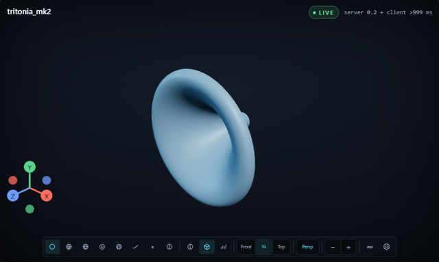
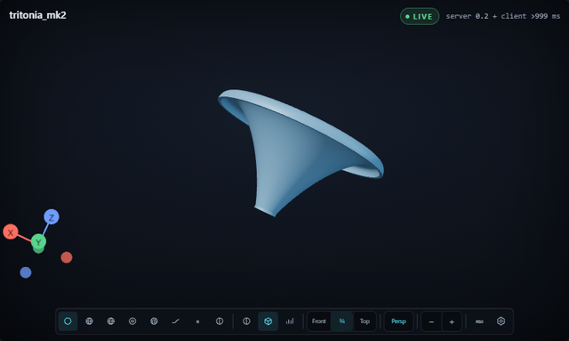

# Windows validation — P6.4

> Historical evidence captured in August 2026. Statements such as “never” and
> “not implemented” describe the captured revision, not the current release state.
> Current gates are maintained in the workspace-local maintainer backlog.

**Status:** first native Windows run of v2, 2026-08-07.

Against P6.4's five items, and deliberately not claiming more than was done:

| P6.4 item | State |
|---|---|
| 1. Bootstrap and serve | **done** |
| 2. gmsh worker thread | **done** — meshed on the worker for every solve here, no Windows-specific failure |
| 3. bempp/OpenCL solve *through the qualification runner* | **partial** — a real bempp solve completed from the UI on the **OpenCL** backend (§2.2, check 6); it has not been run through the qualification runner |
| 4. Installer, and the parent-path-with-spaces case | **partial**, but for a different reason than when this was written — the spaces case is done, and the installer was built on 2026-08-08, after this run. What is missing is that `install.bat` has never been executed on Windows, so the spaces case is proven for bootstrap and the launcher only (§5, item 1) |
| 5. Upgrade-over-v1 and rollback E2E | **done for the tool** — see check 11; not done against a real v1 install, which does not exist on this machine |

Everything below was measured on the machine described in §1. Where a check
could not be completed, it says so and why, rather than being narrowed until it
passed.

---

## 1. Machine

| | |
|---|---|
| OS | Windows 11 Pro, build 10.0.26100 |
| CPU | AMD Ryzen 7 5825U, 12 logical processors |
| Memory | 16 GB |
| GPU | Red Hat VirtIO GPU DOD (QEMU) + Microsoft Remote Display Adapter |
| Virtualisation | QEMU/KVM guest — **no hardware 3D acceleration** |
| Install path | a parent directory containing a space: `…\Hornlab - Workspace\wg2` |
| Data directory | `%APPDATA%\WaveguideGenerator2` — `db/`, `logs/`, `locks/`, `workspace/` all created as documented |

The absence of a real GPU means the viewport renders through a software
rasteriser (check 8). It does not affect the solver, which is CPU BEM.

---

## 2. Prerequisite matrix

| Prerequisite | Needed? | Already present | Version found | Notes |
|---|---|---|---|---|
| CPython 3.13 | yes | yes | 3.13.3 (MSC v.1943 64-bit) | `py -3.13` resolves it; bootstrap rejects any other series |
| Git | yes | yes | 2.53.0.windows.1 | required to install the pinned HornLab modules from Git |
| MS Visual C++ redistributable x64 | yes | **yes** | v14.51.36247.00 | `vcruntime140.dll`, `vcruntime140_1.dll`, `msvcp140.dll` present in System32 |
| Node.js | build only | yes | v24.14.0, npm 11.19.0 | see §2.1 |
| OpenCL runtime | **no** | n/a | n/a | see §2.2 |

Nothing had to be installed. The redistributable was already registered, so
**the v1 trap this task was written around never fired here** — which means the
`bempp_status()` numba probe was not exercised in its failure mode on this
machine. It was exercised in its success mode and proved accurate (check 6).

### 2.1 Node was not an obstacle, but it is still required

`frontend/dist/` is gitignored and no release tag exists yet, so the SPA had to
be built locally. `npm ci` and `npm run build` both succeeded first time on
**Node 24.14.0**, not the Node 20 the plan names — vite 8 built 1263 modules in
7.58 s with no Windows-specific failures. So the Node requirement cost one
build, not debugging.

It remains a real gap for end users. Without `frontend/dist/` the module still
imports, because the module-level ASGI app is lazy, but `create_app()` raises
when it constructs the `StaticFiles` mount. The server cannot start and tests
that construct the SPA-mounting app fail; the launchers separately require
`frontend/dist/index.html`. Until a `v*` tag exists and
`.github/workflows/release.yml` has published an SPA archive, a Windows install
from a clone needs Node.

### 2.2 OpenCL is the solve path, and it works

v2 previously pinned `assembly_backend="numba"` in `server/solver/bempp.py`.
That was wrong on its own terms: the pinned wrapper's `SolveConfig` **defaults**
to `assembly_backend="opencl"`, and its `resolve_assembly_backend()` describes
OpenCL as "the production OpenCL Bempp backend". v2 was overriding the engine's
own production choice with its fallback. It now asks for OpenCL.

The runtime was already present here and needed no installation:

| | |
|---|---|
| ICD | `intelocl64.dll`, registered under `HKLM\SOFTWARE\Khronos\OpenCL\Vendors` |
| Loader | `C:\Windows\System32\OpenCL.dll` 3.0.6.0 |
| Platform | Intel(R) OpenCL 3.0 |
| Device | AMD Ryzen 7 5825U — CPU device, 12 compute units, 16 GB, fp64 |

Note the device is a **CPU**: Intel's CPU runtime drives an AMD processor
perfectly well, and no GPU is involved. `pyopencl==2026.1.2` installs from PyPI
with no build step and is now in `requirements-runtime.txt`.

`bempp-cl 0.4.2` imports as `bempp_cl` — the top-level module was renamed from
`bempp`, so `import bempp` failing is correct and not a broken install.

**numba remains as a warned fallback, never a silent one.** If OpenCL cannot be
used, `bempp_status()` still reports the engine available, but the reason it
returns *is* the warning, naming what to fix:

> Falling back to the numba assembly backend because OpenCL is unusable: …
> Until that is fixed, solves assemble on numba, which is slower, and the first
> solve after each start spends roughly a minute compiling kernels during which
> Stop cannot take effect.

That text reaches `/api/capabilities`, the solve log, and the job's
`assembly_backend_warning` metadata. `test_numba_fallback_is_never_silent` pins
it.

Native dependencies that matter: an OpenCL ICD, and the VC++ redistributable
that the compiled extensions need.

Installed solver stack: `bempp-cl 0.4.2`, `pyopencl 2026.1.2`, `numba 0.66.0`,
`llvmlite 0.48.0`, `gmsh 4.15.2`, `numpy 2.4.6`, `scipy 1.17.1`.

---

## 3. The ten checks

| # | Check | Verdict |
|---|---|---|
| 1 | Bootstrap, clean clone → running server, path with a space | **pass** (after a fix) |
| 2 | Test suites | **pass** (after two test fixes) |
| 3 | Server starts and serves the UI | **pass** |
| 4 | Single-instance lock | **pass** |
| 5 | Capability detection | **pass** |
| 6 | Real bempp solve, end to end from the UI | **pass** |
| 7 | AUTO engine resolution | **pass** |
| 8 | 3D viewport | **pass** |
| 9 | Exports | **pass** |
| 10 | Shutdown and restart | **pass** |
| 11 | Upgrade-over-v1 and rollback (added) | **pass** against a constructed v1 install |
| 12 | Stop latency during a solve (added) | **measured** — see check 12; improved, not eliminated |

### 1. Bootstrap — pass, after fixing a hard blocker

`py -3.13 scripts\bootstrap.py` **fails on every Windows machine** as written.
It installed the full locked set in 2 min 38 s and then refused its own result:

```
Successfully installed hornlab-bempp-bem-0.1.0 hornlab-metal-bem-0.1.0 …
Could not bootstrap Waveguide Generator v2: The environment was installed but
validation failed: one or more required packages are unavailable.
```

The unavailable package is **uvloop**. `uvicorn[standard]` declares it
`sys_platform != 'win32'`, so pip correctly does not install it, but
`_locked_versions()` read every line of `requirements-lock.txt` and asserted
each one was installed at that exact version. Windows could never satisfy that.

Fixed by making the lock state its platform (§4.2). After the fix bootstrap
exits 0. The re-run took 8 s because the packages were already on disk; a true
cold install on this machine is the 2 min 38 s measured above plus validation.

`scripts/bootstrap.py` needed no other Windows work — its `Scripts\python.exe`
layout handling was already correct.

The install path contained a space throughout (`Hornlab - Workspace`). No
quoting defect appeared in bootstrap, the launcher, the server, or the exports.

### 2. Test suites — pass

```
.venv\Scripts\python -m pytest server\tests -q
462 passed, 9 skipped in 47.18s
```

All 9 skips are expected and self-describing: 6 because the v1 checkout is not
beside this one, 1 empty parameter set that follows from those, and 2 native
Metal qualification tests gated behind `WG2_RUN_LIVE=1`.

Two tests **failed on Windows before being fixed** — both were defects in the
tests, not in the product (§4.4):

- `test_custom_v1_workspace_location_is_honoured` — the fixture built
  `workspace_settings.json` by interpolating a path into a JSON string. A
  Windows path's backslashes are invalid JSON escapes, so the migration read a
  corrupt file. The product behaved correctly: it raised
  `MigrationError: Could not read … Invalid \escape`.
- `test_backup_failure_stops_before_writing` — used `chmod(0o500)` to make a
  directory unwritable. On Windows `chmod` only toggles the read-only
  attribute, which directories ignore for creation, so the backup succeeded and
  the assertion never fired.

Neither assertion was weakened. The first now serialises with `json.dumps`; the
second makes the directory genuinely unwritable with a deny ACE on Windows and
keeps `chmod` on POSIX, so both platforms still exercise the real failure path.

The deny ACE names the **SID of the process token**, read from `whoami /user`,
not `getpass.getuser()`. That function reads the environment, which under a
service, container or sandboxed runner can name a different account than the
token actually running the test — review found exactly that divergence in a
sandbox here. Denying the wrong account would leave the directory writable and
fail the test for a reason unrelated to the migration.

Other suites:

```
node --test shared/js/frame.test.mjs   → tests 43, pass 43, fail 0
cd frontend && npm test                → 48 test files, 291 tests, all passed
ruff check server scripts shared       → All checks passed!  (ruff 0.16.1)
```

### 3. Server starts and serves the UI — pass

```
GET http://127.0.0.1:3100/ → 200  text/html; charset=utf-8  5867 bytes
title: Waveguide Generator 2 — tritonia_mk2.cfg
```

This required fixing the `fcntl` import first (§4.1); before that the launcher
could not start at all.

### 4. Single-instance lock — pass

Starting a second server against the same data directory:

```
exit=2 after 1.4s
Waveguide Generator v2 is already running (pid 12512, port 3100;
lock %APPDATA%\WaveguideGenerator2\locks\server.pid).
Close that instance or use it at http://127.0.0.1:3100/.
```

Fails fast, does not hang, and still reports the owner's pid and port. That last
part is not free on Windows and is the reason for the lock offset in §4.1: byte
range locks there are mandatory, so a lock taken at offset 0 would have denied
the *reader* too and degraded this message to "owner metadata is not available
yet".

Stale locks do not wedge the app: the server was hard-killed three times
(`Stop-Process -Force`, no graceful path), each time leaving a lock file naming
a dead pid, and each subsequent start acquired it and rewrote the metadata.

### 5. Capability detection — pass

`GET /api/capabilities`:

```json
{"engines": [
  {"name": "metal", "available": false,
   "reason": "Native Metal helper requires macOS.; Native helper executable not found and Swift executable not found via HORNLAB_METAL_BEM_SWIFT or PATH.",
   "version": "0.1.0", "fast_paths": []},
  {"name": "bempp", "available": true,
   "reason": "hornlab-bempp-bem is importable and its numba assembly backend loads.",
   "version": "0.1.0", "fast_paths": []}],
 "engineSelection": {"default": "auto", "resolvedDefault": "bempp",
   "full3dOrder": ["metal", "bempp", "dryrun"],
   "metalFastPath": "axisymmetric-meridian"}}
```

Metal unavailable with an accurate reason, as expected and not a bug. bempp
available. `circsym` is correctly reported unavailable too, because it depends
on Metal.

### 6. Real solve with bempp, end to end from the UI — pass

Driven from the browser: design loaded, parameters edited in the Simulation
panel, Solve pressed, results and charts read back.

| | |
|---|---|
| Design | `tritonia_mk2.cfg`, R-OSSE, freestanding, thickened wall 5 mm |
| Sweep | 500 Hz – 2 kHz, 20 frequencies, logarithmic |
| Solve mesh | **164 triangles / 103 vertices** in the solved quarter domain (656 full-domain), max edge 50.3 mm |
| Symmetry | auto → 1 quadrant (both mirror planes hold) |
| Engine | AUTO → bempp, `assembly_backend: opencl`, `solver_mode: full_3d` |
| **Wall clock** | **58.5 s** (15:19:11.215 → 15:20:09.724); engine-reported `total_time_seconds` 58.03 |
| Result | `status: complete`, no error, `has_results: true` |

Results returned `frequencies` (20), `directivity`, `spl_on_axis`, `impedance`
and `di`. The Results panel populated every chart: Directivity Map (H/V/All),
Frequency Response, Directivity Index, Forward Beam Shape/Map, 3D Balloon,
Acoustic Impedance, Simulation Summary. The job row reads
`59 s · 164 el · 20 f · bempp`.

The mesh was deliberately coarsened (throat 14 mm, mouth 28 mm, surface sampling
96 × 32) so a first end-to-end run would finish quickly. At 50.3 mm max edge and
a 2 kHz ceiling this is roughly λ/3.4 — **fast, not acoustically converged.**
This check proves the Windows solve path works; it is not a physics result and
should not be used as one.

**The `bempp_status()` probe told the truth here** — it reported available and
the solve then completed, rather than reporting available and dying inside
numba, which is the failure v1 suffered.

That is one machine's result, not proof the probe is gap-free, and it is worth
being precise about what it actually checks. `_assembly_backend_status()`
imports `numba`; `_load_api()` imports `hornlab_bempp_bem`. Measured here, that
wrapper does **not** import `bempp_cl` at module scope — after importing it,
no `bempp_cl` module is in `sys.modules` — so the probe never touches the
assembler that does the work. A broken `bempp_cl`, an ABI mismatch, or a first
JIT failure would still get past capability detection. Closing that would take
a minimal assembly smoke test in the probe; it is not done.

### 7. AUTO engine resolution — pass

AUTO skips the unavailable Metal engine and lands on bempp without erroring, at
three independent layers:

- registry: `resolve_auto_engine()` → `bempp`
- HTTP: `engineSelection.resolvedDefault` → `bempp`
- UI: the toolbar button reads "Solve current design with AUTO (bempp)"
- the executed job recorded `engine: bempp` in its config summary

Re-confirmed after every restart. No defect here.

### 8. The 3D viewport — pass

**Geometry appears, and it orbits.** Both captured from Microsoft Edge 151 in
headless mode, driven over the DevTools Protocol.

| Before the drag | After a left-drag across the canvas |
|---|---|
|  |  |

The camera rotates from the three-quarter view to a near edge-on one and the
orientation gizmo turns with it, while the rest of the interface is pixel-identical
— so the change is the camera, not a re-layout or a reload. The full-page capture
also shows the result charts from check 6 rendering correctly (on-axis SPL,
directivity H and V heat maps, DI, impedance, summary).

Reproduce with:

```
msedge --headless=new --enable-unsafe-swiftshader --use-gl=angle --use-angle=swiftshader --window-size=1600,1000 --virtual-time-budget=30000 --screenshot=viewport.png http://localhost:3100/
```

The renderer initialises cleanly. The only console output in the entire session
was one `THREE.Clock: This module has been deprecated` warning — no errors.

```
WebGL 2.0 (OpenGL ES 3.0 Chromium)
vendor:   Google Inc. (Microsoft)
renderer: ANGLE (Microsoft, Microsoft Basic Render Driver (0x0000008C), Direct3D11 vs_5_0 ps_5_0, D3D11)
```

**The one caveat:** every render here goes through a software rasteriser.
`Microsoft Basic Render Driver` is WARP, and the headless captures force
SwiftShader, because this VM exposes no GPU. So ANGLE's Direct3D11 path is
exercised, but never against a real display driver, and nothing can be said
about frame rates. Correctness of the viewport on Windows is established;
performance on real hardware is not.

An earlier attempt to capture this through the in-app browser pane failed —
`requestAnimationFrame` never fired because the pane was not displayed, so both
screenshots and `gl.readPixels` came back empty. That was a property of that
pane, not of Windows or of the app; a headless browser renders it fine.

### 9. Exports — pass

All four exports were requested through the UI's Design → Export menu, then
replayed against the API to write files to disk and inspect them.

| File | Bytes | Time | Structure check |
|---|---|---|---|
| `.step` | 3,137,513 | 6.4 s | `ISO-10303-21;` … `END-ISO-10303-21;`, OpenCASCADE 7.8 header — valid |
| `.stl` | 1,862,484 | 51.7 s | **binary** STL, header `MWG Horn`, 37,248 triangles; file size == 84 + 50 × N exactly |
| profiles `.csv` | 94,793 | <1 s | `# x_cm;y_cm;z_cm`, 1,584 data rows |
| slices `.csv` | 95,630 | <1 s | 1,617 data rows |

Worth knowing: the STL export is **binary**, not ASCII. Grepping it for
`facet normal` returns zero and looks like a failure; it is not.

### 10. Shutdown and restart — pass for crash/restart; graceful path not verified

**Job recovery: pass.** A 200-frequency solve was submitted and the server
hard-killed 18 s in, leaving a genuinely stuck row:

```
before restart:  f2a63354  status=running  stage=assemble  progress=0.3
after restart:   f2a63354  status=error    stage=error     progress=0.3
                           error_message = "Server restarted during execution"
```

Not lost, not stuck "running". The two previously completed jobs were untouched
across the restart, as were their results.

**Lock release: pass.** Verified after abnormal exit — three hard kills, three
clean restarts over a lock file naming a dead pid. Also covered by
`test_instance_lock_acquire_conflict_and_release`, which does
acquire → conflict → release → re-acquire and passes on Windows.

**Graceful shutdown: pass.** `launch/serve.py` now also handles `SIGBREAK`,
which is what Ctrl+Break raises on Windows, alongside `SIGINT` and `SIGTERM`.
That is worth having on its own — `SIGTERM` cannot be delivered by another
process on Windows at all, because `os.kill` there terminates rather than
signals for a non-zero signal (this is *not* true of signal 0, whatever an
earlier version of 4.1a claimed: see the correction there) — and it
is also the only stop signal that can be addressed to a *specific* process
group, which is what finally made this testable. `CTRL_BREAK_EVENT` aimed at
the server's own group cannot touch any other console, unlike
`GenerateConsoleCtrlEvent(CTRL_C_EVENT, 0)`, which signals every process sharing
the caller's console and is why the first attempt at this check was abandoned.

```
sending CTRL_BREAK_EVENT to that group only
  Received SIGBREAK; finishing active requests and shutting down
  Shutdown complete; instance lock released
exited with code 0 after 0.61s
  re-acquired the lock cleanly -> it was released
```

Still not handled: closing the console window. Windows delivers that as
`CTRL_CLOSE_EVENT`, which Python does not surface as a signal, so it remains an
abrupt exit. The consequences of an abrupt exit are the crash-recovery path
above, which is proven, so this is a rough edge rather than a defect.

**A Windows detail worth knowing:** the pid you spawn is usually not the pid
that serves. `.venv\Scripts\python.exe` is a launcher stub that runs the real
interpreter as a child, so `serve.py` appears twice in the process list with
identical command lines, and it is the **child** that owns the instance lock.
Anything that signals or tracks the server by the pid it spawned will address
the stub. Console control events go to the process group, so they reach both.

### 11. Upgrade-over-v1 and rollback — pass, against a constructed v1 install

The real 109 MB v1 database is not on this machine, so the v1 side was built to
the shape `migrate_v1.py` reads — v1 schema at `user_version 4`, 40 jobs with
results and mesh artifacts, 25 `output/` projects — under a path containing a
space. What this exercises is the tool and v2's reader, on Windows.

| Step | Result |
|---|---|
| `--dry-run` | reports the full plan; **no v2 database created** |
| migrate `--report` | 40 jobs / 40 results / 40 artifacts, 25 workspace projects |
| re-run | *"already migrated (40 jobs). Nothing to do."* — counts unchanged |
| `--rollback` | back to 0 jobs and 0 projects, and it names both the directory it restored into and where it saved the state it replaced |

It also correctly warns that no imported job can be reopened: 10 of 40 have no
design snapshot and 30 carry v1's parameter shape.

Cloning v1 beside this checkout also un-skipped the corpus tests, which now run
against v1's real ATH fixtures: **9 skips became 7**, and 476 tests pass.

### 12. Stop latency during a solve — measured, improved, not solved

Reported from real use: pressing Stop does not stop the solve immediately. It is
reproducible and it is not a Windows defect — it is cooperative cancellation
meeting a long uninterruptible block.

From the job's own event log, on the numba backend:

```
19:50:33.374  stage=assemble   "Configuring BEMPP BEM solve"  progress 0.30
19:50:57.210  stage=cancelling  <- Stop pressed
19:51:25.958  cancelled                                        28.7s later
```

`_check_cancelled` only runs at stage checkpoints, and inside the engine the
only checkpoint is the per-frequency progress callback. The first callback does
not fire until the first assembly finishes, so Stop cannot land during it.

Measured cold-versus-warm, 3 frequencies, same design:

| Backend | First solve after start | Blocked, no checkpoint | Second solve |
|---|---|---|---|
| numba | 64.3 s | **53.8 s** | 0.8 s |
| OpenCL, first ever | 24.5 s | 22.9 s | 1.0 s |
| OpenCL, later starts | 18.3 s | **17.5 s** | 0.7 s |

Switching to OpenCL cuts the unstoppable window roughly threefold, and pyopencl's
on-disk program cache takes a little more off after the first run. It does not
remove it. Two things would:

- **Warm the backend at boot**, extending the existing `BackgroundWarmup` used
  for the capability probe. It moves the cost off the user's first solve
  entirely, at the price of that CPU on every start.
- **Process-isolated solves**, which the cutover plan explicitly defers — that
  is the only way Stop becomes immediate rather than merely prompt.

Neither is done. numba's kernels are mostly not `cache=True` (14 of 103
decorations), so `NUMBA_CACHE_DIR` would not have helped that path.

---

## 4. Changes made, and why

### 4.1 `server/platform/instance.py` — a portable single-instance lock

`import fcntl` at module scope made this an `ImportError` before anything ran,
and `launch/serve.py` imports `InstanceLock` from it at module scope too, so the
launcher could not start on Windows at all.

The platform split is a pair of module-level helpers, `lock_exclusive()` and
`unlock()`, so `InstanceLock` itself is unchanged apart from calling them.
`msvcrt.locking(fd, LK_NBLCK, 1)` is the Windows equivalent of
`flock(LOCK_EX | LOCK_NB)`; contention arrives as `EACCES` and is re-raised as
`BlockingIOError` so the existing `except BlockingIOError` path still means
"another instance owns this".

Two Windows-specific details were measured, not guessed:

- **`LOCK_BYTE_OFFSET = 1 << 30`.** Windows byte-range locks are mandatory and
  are taken from the current file position. A probe confirmed that locking
  offset 0 breaks the feature in both directions: the owner's own
  `os.ftruncate` in `update_port()` fails with `EACCES`, and any other process
  reading the metadata fails with `EACCES` as well — which would have reduced
  the "already running" message to its no-metadata fallback. Locking a byte
  past everything the file will ever hold avoids both. POSIX `flock` takes the
  whole file and ignores the offset, so the constant is inert there.
- **`LOCK_OPEN_FLAGS` adds `O_BINARY`.** Windows descriptors are text mode
  unless asked otherwise; a probe showed `os.write(fd, b'{"pid": 1}\n')`
  landing on disk as `…}\r\n`. The lock file now reads back byte-for-byte on
  every platform.

`InstanceLock` also gained a reentrant `threading.RLock` around `acquire`,
`update_port` and `release`. The single descriptor's file position is now moved
by locking and unlocking as well as by every metadata rewrite, so two threads
could interleave a seek with another's truncate and leave malformed metadata.
No caller does this today — `serve.py` holds one lock on one thread — but the
extra seeks are mine, so the hazard is mine to close.

### 4.1a `_pid_is_running()` used the wrong Windows liveness probe

Not required to make anything start, fixed because leaving it would be a
landmine in a module being made portable.

**Correction (2026-08-22).** This section previously claimed that
`os.kill(pid, 0)` terminates the process it is asked about, because CPython
implements `os.kill` on Windows as `OpenProcess` + `TerminateProcess`. That
claim is **false** and the "demonstrated directly" evidence behind it did not
survive re-measurement: two independent Windows sessions, on CPython 3.13.3 and
on the bundled 3.13.12, measured a live process still running afterwards,
confirmed by both `poll()` and `tasklist`. The claim was repeated in a source
comment in `server/platform/instance.py`, where it was read and reasoned from in
good faith months later; both have been corrected. Do not restore it.

The real defect is narrower and still worth the change. `os.kill(pid, 0)` raises
a plain `OSError` (WinError 87) for a pid that no longer exists, which is neither
`ProcessLookupError` nor `PermissionError`, so a probe catching only those two
lets it escape. More importantly, Win32 keeps a process object resolvable while
any handle to it is open, so `os.kill` reports an exited process as **running**
for as long as anything holds a handle on it — a silent hang rather than a crash.

The function has no call site today, which is why nothing has been damaged, but
it is monkeypatched by `test_platform_batch_e.py` and is exactly the shape
someone would wire into stale-lock handling next. It now branches to
`OpenProcess(PROCESS_QUERY_LIMITED_INFORMATION)` + `GetExitCodeProcess` on
Windows, treating `ERROR_ACCESS_DENIED` as "alive but not ours to open".

It also asks for `SYNCHRONIZE` and prefers `WaitForSingleObject(handle, 0)`,
because `STILL_ACTIVE` is 259: a process that exits with code 259 is
indistinguishable from a running one by exit code alone, and would be reported
alive forever. The wait is unambiguous, and the exit code remains the fallback
for a process we may query but not synchronise on.

Those three Win32 calls carry explicit `argtypes`/`restype`. Without them ctypes
assumes a C `int` return, but a `HANDLE` is pointer-sized: on 64-bit Windows the
handle would be truncated, `GetExitCodeProcess` would fail, the function would
answer "running" for a dead process, and `CloseHandle` would leak the real
handle while closing a bogus value. `test_pid_liveness_probe_answers_without_killing`
now pins both halves — the answer and the survival of the process asked about.

### 4.2 `requirements-lock.txt` and `scripts/bootstrap.py` — the uvloop blocker

The lock now carries the marker that was always implied:

```
uvloop==0.22.1; sys_platform != "win32"
```

and `_locked_versions()` parses the marker while `_validate()`'s in-environment
probe evaluates it with `packaging.markers.Marker`. Marker evaluation has to
happen inside the environment under test because the interpreter running the
bootstrap has no third-party packages.

`packaging` is therefore a real bootstrap dependency and is now named in
`requirements-runtime.txt`. Appearing in `requirements-lock.txt` would not have
been enough: the lock is passed with `-c`, and a constraint only bounds a
version, it does not install anything. It arrived transitively via matplotlib
and pytest, which is a dependency of theirs to change, not a promise to us.

`gen_requirements.py` only generates `requirements-pins.txt`, so editing the
lock cannot trip the CI drift gate. `pins.json` and the pinned SHAs are
untouched.

### 4.3 `launchers/windows/launch-wg2.bat` — Windows launcher

Same environment shape as the macOS launcher: verify the folder, honour
`WG2_PYTHON`, otherwise validate `.venv` with `bootstrap.py --check` and bootstrap
if needed, then start `launchers/statusapp/`. The status app reports a missing
`frontend/dist`, and `--no-gui` retains direct terminal server behavior.

Three of v1's four documented traps applied and were carried over:

- **Store alias.** Every `where` match is considered, not just the first, and
  anything under `\WindowsApps\` is skipped with a specific message pointing at
  the App execution aliases setting. `py -3.13` is tried first because it
  resolves the required series directly.
- **Parenthesised probes.** Every probe containing parentheses lives in a
  subroutine, never inlined into an `if (…)` block — the bug that made v1
  discard a healthy `.venv` and rebuild it on every run.
- **Paths with spaces.** Quoted throughout; exercised for real by the install
  location.

The fourth does not apply: this launcher never pulls over itself, so it needs no
copy-to-`%TEMP%` staging. After the public-entry reorganization, `%~dp0` is the
launcher folder and the script resolves the repository explicitly via `..\..`.
A v2 *installer* that self-updates still needs
v1's `install-and-update.bat` dance, and that is P6.2, not this change.

Four further Windows-specific defects were found by review after the first
draft, each reproduced before being fixed:

- **Delayed expansion corrupted valid paths.** `setlocal EnableDelayedExpansion`
  makes cmd rescan every expanded value for `!` and `^`, so a repository under
  a folder containing `!` lost those characters, `cd /d` failed, and the
  launcher reported it was in the *caller's* directory. Verified against eight
  path shapes: `bang! dir` failed before, all eight pass now. Delayed expansion
  is simply off — nothing here needed it, because `if defined` is evaluated at
  execution time and the one interpolated value is read on a later line.
- **The Store-alias probe re-parsed its argument.** `echo %~1| find …` turns an
  interpreter path containing `&` into two commands; reproduced as
  `C:\tools\py&thing\python.exe` echoing `C:\tools\py` and then trying to run
  `thing\python.exe`. It is now a case-insensitive substring replacement, which
  never treats the candidate as command text and needs no subprocess.
- **`if exist "path\"` calls a file a directory.** Confirmed on this build: the
  idiom returns true for `python.exe`. The directory rejection for `WG2_PYTHON`
  now reads the attribute letters via `%~a1` instead, which distinguishes file,
  directory and missing correctly.
- **The wrong repair was suggested for an overridden interpreter.** When
  `WG2_PYTHON` pins an environment that cannot import FastAPI, telling the user
  to bootstrap `.venv` fixes something the launcher will not use. It now says to
  unset the override or install into that interpreter.

It also pauses only when double-clicked, using v1's `CMDCMDLINE` test. That test
inherits v1's blind spot, observed here: it matches the script's own filename,
so an explicit `cmd /c "…\launchers\windows\launch-wg2.bat"` looks like a double-click and pauses
on the failure path. Rather than diverge from the reference implementation's
heuristic, scripted callers get an explicit opt-out: **set `WG2_NO_PAUSE=1`**
and the launcher never pauses.

### 4.5 `.gitattributes` — batch files check out CRLF

`launchers/windows/launch-wg2.bat` would otherwise take its line endings
from the cloning user's `core.autocrlf`, so a clone with it disabled hands
cmd.exe an LF-only batch file. That mostly works and then does not, around
labels and `goto`. The attribute is scoped to `*.bat`, so nothing else in the
tree is renormalised. Verified: a fresh checkout produces 197 CRLF endings and
the launcher runs correctly from it.

### 4.4 Test fixes

Described under check 2. `server/tests/test_platform_luna.py` no longer imports
`fcntl` directly; it takes the lock through the same `instance.lock_exclusive`
helper the product uses, which keeps the test meaningful on both platforms
instead of asserting a POSIX mechanism.

---

## 5. Still broken, or unverified

Ordered by how much it matters.

1. **The installer exists; nobody has ever run its Windows half.** It was built
   on 2026-08-08, after this report; its public entries now live under
   `installers/{macos,linux,windows}/`, while the shared machinery remains
   `scripts/install.{sh,bat}` and `scripts/uninstall.{sh,bat}`,
   `scripts/fetch_spa.py` (download, checksum-verify and install the release
   SPA) and `scripts/check_backends.py`, with v1's two contract suites ported
   to `server/tests/test_installer_contract.py` and
   `test_installer_env_contract.py`, 44 tests. That closes the gap this item
   used to describe, but it does not make the Windows path verified: the three
   batch files were written on macOS against v1's, are checked only statically,
   and **have never been executed by anyone**. A Windows run would be the first
   execution of, among others:
   - the exit-10 relaunch — `install.bat` returning 10 after a fast-forward
     rather than calling the installer it has just overwritten, and
     `install-and-update.bat` re-copying to `%TEMP%` and re-running it once,
     refusing a second round;
   - the Microsoft Store `python.exe` alias skip, which recognises the alias by
     substring-replacing `\WindowsApps\` out of the candidate path;
   - the VC++ redistributable check — `vcruntime140.dll`, `vcruntime140_1.dll`
     and `msvcp140.dll` under `%SystemRoot%\System32`, which on this machine
     were already present (§2);
   - the PowerShell `Tee-Object` transcript, used because a plain cmd pipe takes
     its `ERRORLEVEL` from the right-hand side and would destroy the exit code
     the relaunch depends on;
   - `set /p` in `uninstall.bat`, which requires the user to type `remove`.

   Nor has any release artifact been fetched over HTTPS, on any platform: no
   `v*` tag exists and `release.yml` has never fired, so the whole download is
   exercised against `file://` fixtures shaped like a release.
   The workspace-local release backlog now separates current gates from what this
   report proved by execution versus what was only written.
2. **Stop is prompt, not immediate.** Check 12. The first solve after a start
   still has a ~17 s window with no cancellation checkpoint in it. An explicit
   `WG2_SOLVER_WARMUP=1` experiment can move that cost earlier, but it is not a
   release default because it can overlap a user solve and native shutdown.
   Fixing this properly needs process-isolated solves.
3. **The viewport has never rendered on a real GPU** — and by decision
   (Magnus, 2026-08-08) it never has to: *"the windows machine doesn't have GPU,
   and the program shouldn't need gpu."* Software rasterisation is a supported
   target, not a degraded one, so this row is no longer a gap to close but a
   constraint to design against. Check 8 passes; every render on this machine
   goes through WARP or SwiftShader because the VM exposes no display adapter.
   What remains unmeasured is the hardware ANGLE/D3D11 path, which needs
   different hardware and is not required to work well.
4. **The v1 migration was never run against a real v1 install.** Check 11 used a
   constructed one, because no v1 database or `output/` history exists here.
   Three `test_legacy_snapshot.py` tests still skip for the same reason.
5. **The VC++ and OpenCL failure modes were never seen for real.** Both
   runtimes were already installed, so the missing-DLL branch and the
   no-OpenCL-runtime branch are covered by tests with faked failures rather
   than by a genuinely clean box.
6. **Windows CI leg is written but unexecuted (as of 2026-08-08).** The server
   matrix in `.github/workflows/ci.yml` includes `windows-latest`, but no v2
   workflow run has exercised it yet. This is another never-run path, not a job
   that remains to be implemented.
7. ~~**The original traceability inventory was stale.**~~ **Corrected 2026-08-08**
   when this branch merged: P011/Q007 now says `fcntl` on POSIX, `msvcrt.locking`
   plus a Win32 liveness probe on Windows, and names the module-scope `fcntl`
   import that had made the module unloadable there.
8. **Solve accuracy was not assessed.** Check 6 used a deliberately coarse mesh
   to prove the path. No Windows-vs-macOS numerical parity comparison was run,
   and switching the assembly backend to OpenCL makes that comparison more
   interesting, not less; it belongs to the qualification runner.
9. **The qualification runner was not used.** P6.4 item 3 asks for the bempp
   path through it. The solve here was driven from the interface.

---

## 6. What would surprise someone who has only run this on macOS

Beyond the launcher and lock work already described:

- **`os.kill(pid, 0)` kills the process.** The idiom every POSIX developer uses
  to test liveness is destructive on Windows. See §4.1a.
- **uvloop simply does not exist here.** Any check that treats a resolved
  lockfile as a flat list of must-be-installed packages will fail on Windows,
  which is exactly what bootstrap did.
- **File locks are mandatory and positional.** A POSIX `flock` is advisory and
  whole-file; the Windows equivalent denies other processes real access and
  applies only to the byte range at the current file offset. Where you lock
  changes what still works.
- **`os.open` gives you a text-mode descriptor.** `\n` becomes `\r\n` on the
  way to disk unless you pass `O_BINARY`.
- **`chmod` cannot make a directory unwritable.** It sets the read-only
  attribute, which directories ignore for creation. Tests that build a
  permission-denied condition with mode bits silently do nothing. A deny ACE
  (`icacls … /deny user:(WD,AD)`) does work and produces a real
  `PermissionError: [WinError 5]`.
- **PowerShell cannot parse this project's design JSON.** `ConvertFrom-Json` is
  case-insensitive, and an ATH design has both `R` (mouth radius) and `r`
  (throat rounding) at the same level, so it fails with *"a dictionary … contains
  the duplicated keys 'R' and 'r'"*. Anyone scripting against the API from
  PowerShell must treat the design as opaque text, or use Python. This affects
  `/api/solve` and every `/api/export/*` payload.
- **`python` on PATH may be a Microsoft Store stub.** A zero-byte alias in
  `%LOCALAPPDATA%\Microsoft\WindowsApps` that opens the Store. The launcher
  skips it; anything else calling `python` directly will not.
- **The STL export is binary.** It contains no `facet normal` text.
- **A sqlite3 connection used as a context manager commits but does not close.**
  On POSIX the leaked handle is invisible; on Windows it stops the file being
  deleted or replaced, with `WinError 32`. This broke rollback, and it was
  present in both `scripts/migrate_v1.py` and the migration tests' own helpers.
  `contextlib.closing` is the fix; write paths need `closing(conn) as c, c` to
  keep the commit.
- **`sqlite3.connect` creates the file it cannot find**, so an existence check
  written after a connect attempt manufactures the empty database it reports.
- **The venv's `python.exe` is a launcher stub.** It runs the real interpreter
  as a child process, so the pid you spawn is not the pid that serves.

None of these are v2 design faults; they are the platform. They are recorded
here so the next person does not spend the same afternoon on them.
